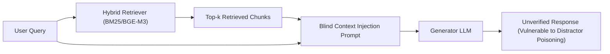
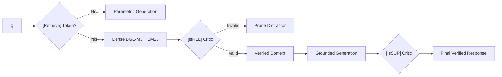

# 🔍 Review Toàn Bộ Biểu Đồ Mermaid Trong Demo

**File**: `src/diagrams.py` — 6 diagrams × 2 ngôn ngữ (EN+VI)

---

## 1. `naive_rag` — Kiến trúc Naive RAG



### Đánh giá: ✅ Tốt
- **Đúng concept**: Pipeline tuyến tính Query → Retrieve → Concatenate → Generate
- **Rõ ràng**: Người đọc hiểu ngay flow
- **Điểm nhấn đúng**: "Blind Context Injection" + "Unverified" + màu đỏ cho output
- **Nhỏ gọn**: LR layout, 6 nodes — vừa vặn

### Vấn đề nhỏ:
- "Blind Context Injection Prompt" hơi kỹ thuật. Có thể đổi thành "Context Concatenation (No Verification)"

---

## 2. `self_rag` — Kiến trúc Self-RAG



### Đánh giá: ⚠️ Cần sửa
- **Đúng workflow**: Retrieve gate → IsREL → Generate → IsSUP → output
- **Thiếu**: `[IsUSE]` chỉ ghi ở output label, không có node riêng

### Vấn đề:
1. **IsSUP không có nhánh reject** — diagram chỉ có 1 mũi tên ra OUT. Nếu IsSUP fail thì sao? Cần thêm nhánh "Not Supported → Regenerate"
2. **Không có vòng lặp (loop)** — Self-RAG paper nhấn mạnh đây là LOOP (iterate over segments). Diagram hiện tại là tuyến tính 1 chiều, giống pipeline hơn là loop
3. **`[IsREL] Critic` label** — nên đổi thành `[IsREL] Relevance Check` cho rõ
4. **Thiếu nhánh PARAM**: Khi [Retrieve] = No, PARAM nên nối vào OUT (hiện tại PARAM bị "chết" — dead end)

---

## 3. `graphrag` — Kiến trúc GraphRAG Map-Reduce

### Đánh giá: ✅ Tốt — Biểu đồ tốt nhất
- **Đúng concept**: Corpus → Extract → Graph → Community Detection → Map → Reduce → Global Answer
- **TD layout phù hợp**: Thể hiện rõ pipeline phân tầng
- **3 communities song song + reduce** rất trực quan
- **Có cả VI lẫn EN** đồng nhất

### Vấn đề nhỏ:
- "Entity & Cross-Reference Extraction" — code thực tế **không** extract entity bằng LLM, mà hand-craft. Nên thêm note "(Simplified)" hoặc đổi thành "Predefined Cross-Reference Mapping"

---

## 4. `flare` — Kiến trúc FLARE

### Đánh giá: 🔴 SAI NGHIÊM TRỌNG

```
CONF{"Token Confidence Check — P(token) < Threshold θ?"}
```

**Vấn đề chính**:
1. **Ghi `P(token)` — SAI!** Code KHÔNG dùng token probability. Code dùng **verbalized confidence** (LLM tự khai). Diagram đang gây hiểu lầm nghiêm trọng rằng hệ thống đo logprobs thực.
2. **"Sentence-by-Sentence Forward Drafting"** — Code thực tế **sinh toàn bộ draft trước**, rồi iterate post-hoc. Không phải forward sentence-by-sentence.
3. **"Tiết kiệm 67% chi phí truy xuất" (VI)** — Con số 67% lấy từ đâu? Không có benchmark nào chứng minh.

### Cần sửa:
- `P(token) < θ` → `Conf_LLM(sentence) < θ`
- "Token Confidence Check" → "Verbalized Confidence Check"  
- "Sentence-by-Sentence Forward Drafting" → "Draft Generation + Post-hoc Verification"
- "67%" → bỏ con số cụ thể

---

## 5. `offline_vs_online` — Pipeline Indexing vs Serving

### Đánh giá: ✅ Tốt
- **Rõ ràng**: 2 subgraph phân biệt Offline/Online
- **Chi tiết kỹ thuật đúng**: BGE-M3 d=1024, BM25, RRF k=60, NPY file
- **Dot product < 0.1ms** — chính xác cho 15 articles

### Vấn đề nhỏ:
- Hơi phức tạp cho seminar 30 phút. Nhưng nằm trong Tab 5 (Data Explorer) nên OK.

---

## 6. `knowledge_graph_full` — Đồ thị tri thức pháp lý

### Đánh giá: ✅ Rất tốt
- **3 communities rõ ràng** với màu khác nhau (xanh/cam/tím)
- **Dashed arrows (cross-chapter bridges)** thể hiện đúng concept Local Blindness
- **Edge labels** mô tả quan hệ pháp lý chuẩn
- **Node D25 highlighted** (focus article cho demo)

### Vấn đề nhỏ:
- Có thể thêm legend giải thích solid vs dashed arrows (đã có trong caption nhưng không trong diagram)

---

## TỔNG KẾT

| # | Diagram | Verdict | Vấn đề chính |
|:--:|---|:--:|---|
| 1 | `naive_rag` | ✅ Tốt | — |
| 2 | `self_rag` | ⚠️ Cần sửa | Dead-end PARAM, thiếu loop, IsSUP 1 chiều |
| 3 | `graphrag` | ✅ Tốt | Nhỏ: "Extract" misleading |
| 4 | `flare` | 🔴 **SAI** | `P(token)` sai, "67%" bịa, forward drafting sai |
| 5 | `offline_vs_online` | ✅ Tốt | — |
| 6 | `knowledge_graph_full` | ✅ Rất tốt | — |

### 🔴 Ưu tiên sửa ngay: FLARE + Self-RAG diagrams
