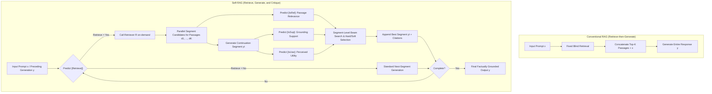

# Self-RAG: Learning to Retrieve, Generate, and Critique through Self-Reflection

**Authors:** Akari Asai¹, Zeqiu Wu¹, Yizhong Wang¹, Avirup Sil², Hannaneh Hajishirzi¹³

¹University of Washington, ²IBM Research AI, ³Allen Institute for AI

**Correspondence:** `{akari,zeqiuwu,yizhongw,hannaneh}@cs.washington.edu`, `avi@us.ibm.com`

**Conference:** Published as a conference paper at ICLR 2024

**ArXiv ID:** [2310.11511](https://arxiv.org/abs/2310.11511) | **Project Page & Code:** [https://selfrag.github.io/](https://selfrag.github.io/) | [GitHub Repository](https://github.com/AkariAsai/self-rag)


---

## Abstract

Despite their remarkable capabilities, large language models (LLMs) often produce responses containing factual inaccuracies due to their sole reliance on the parametric knowledge they encapsulate. Retrieval-Augmented Generation (RAG), an ad hoc approach that augments LMs with retrieval of relevant knowledge, decreases such issues. However, indiscriminately retrieving and incorporating a fixed number of retrieved passages, regardless of whether retrieval is necessary, or passages are relevant, diminishes LM versatility or can lead to unhelpful response generation. We introduce a new framework called Self-Reflective Retrieval-Augmented Generation (Self-Rag) that enhances an LM’s quality and factuality through retrieval and self-reflection. Our framework trains a single arbitrary LM that adaptively retrieves passages on-demand, and generates and reflects on retrieved passages and its own generations using special tokens, called reflection tokens. Generating reflection tokens makes the LM controllable during the inference phase, enabling it to tailor its behavior to diverse task requirements. Experiments show that Self-Rag (7B and 13B parameters) significantly outperforms state-of-the-art LLMs and retrieval-augmented models on a diverse set of tasks. Specifically, Self-Rag outperforms ChatGPT and retrieval-augmented Llama2-chat on Open-domain QA, reasoning and fact verification tasks, and it shows significant gains in improving factuality and citation accuracy for long-form generations relative to these models. Our code and trained models are available at [https://selfrag.github.io/](https://selfrag.github.io/).


> [!NOTE] Key Concepts & Contributions
> - **Self-Reflective RAG (Self-RAG):** A framework that trains a single arbitrary language model to adaptively retrieve passages on demand, generate text, and self-critique both retrieved passages and generated continuations using special *reflection tokens*.
> - **Reflection Tokens:** Two functional classes of special tokens added to the LM's vocabulary:
>   1. *Retrieval tokens* (`[Retrieve]` $\in \{\text{Yes}, \text{No}, \text{Continue}\}$): Decide whether retrieval of external evidence is needed at any segment step.
>   2. *Critique tokens* (`[IsRel]` $\in \{\text{Relevant}, \text{Irrelevant}\}$, `[IsSup]` $\in \{\text{Fully supported}, \text{Partially supported}, \text{No support}\}$, `[IsUse]` $\in \{1, 2, 3, 4, 5\}$): Evaluate passage relevance, factual support/entailment, and overall perceived utility.
> - **Critic & Generator Synergy:** A critic model $\mathcal{C}$ is trained on GPT-4 distilled annotations offline and used to insert reflection tokens into instruction datasets; the generator LM $\mathcal{M}$ is then trained end-to-end to predict task tokens and reflection tokens via standard next-token prediction, eliminating critic inference overhead.
> - **Controllable Inference & Tree Decoding:** Reflection token probabilities enable customizable decoding algorithms (hard filtering vs. soft reward weighting in segment-level beam search), allowing users to trade off retrieval frequency, citation precision, and fluency without retraining.
> - **State-of-the-Art Performance:** Outperforms ChatGPT, standard RAG baselines, and instruction-tuned LLMs across short-form QA (PopQA, TriviaQA), reasoning/verification (ARC-C, PubHealth), and long-form generation (biographies, ASQA), while drastically elevating citation precision and recall.

---

## 1 Introduction

State-of-the-art LLMs continue to struggle with factual errors ([Mallen et al. 2023](#bib.bib28); [Min et al. 2023](#bib.bib32)) despite their increased model and data scale ([Ouyang et al. 2022](#bib.bib36)). Retrieval-Augmented Generation (RAG) methods (Figure [1](#S1.F1) left; [Lewis et al. 2020](#bib.bib21); [Guu et al. 2020](#bib.bib12)) augment the input of LLMs with relevant retrieved passages, reducing factual errors in knowledge-intensive tasks ([Ram et al. 2023](#bib.bib41); [Asai et al. 2023a](#bib.bib2)). However, these methods may hinder the versatility of LLMs or introduce unnecessary or off-topic passages that lead to low-quality generations ([Shi et al. 2023](#bib.bib45)) since they retrieve passages indiscriminately regardless of whether the factual grounding is helpful. Moreover, the output is not guaranteed to be consistent with retrieved relevant passages ([Gao et al. 2023](#bib.bib11)) since the models are not explicitly trained to leverage and follow facts from provided passages. This work introduces Self-Reflective Retrieval-augmented Generation (Self-Rag) to improve an LLM’s generation quality, including its factual accuracy without hurting its versatility, via on-demand retrieval and self-reflection. We train an arbitrary LM in an end-to-end manner to learn to reflect on its own generation process given a task input by generating both task output and intermittent special tokens (i.e., reflection tokens). Reflection tokens are categorized into retrieval and critique tokens to indicate the need for retrieval and its generation quality respectively (Figure [1](#S1.F1) right). In particular, given an input prompt and preceding generations, Self-Rag first determines if augmenting the continued generation with retrieved passages would be helpful. If so, it outputs a retrieval token that calls a retriever model on demand (Step 1). Subsequently, Self-Rag concurrently processes multiple retrieved passages, evaluating their relevance and then generating corresponding task outputs (Step 2). It then generates critique tokens to criticize its own output and choose best one (Step 3) in terms of factuality and overall quality. This process differs from conventional RAG (Figure [1](#S1.F1) left), which consistently retrieves a fixed number of documents for generation regardless of the retrieval necessity (e.g., the bottom figure example does not require factual knowledge) and never second visits the generation quality. Moreover, Self-Rag provides citations for each segment with its self-assessment of whether the output is supported by the passage, leading to easier fact verification.

Self-Rag trains an arbitrary LM to generate text with reflection tokens by unifying them as the next token prediction from the expanded model vocabulary. We train our generator LM on a diverse collection of text interleaved with reflection tokens and retrieved passages. Reflection tokens, inspired by reward models used in reinforcement learning ([Ziegler et al. 2019](#bib.bib58); [Ouyang et al. 2022](#bib.bib36)), are inserted offline into the original corpus by a trained critic model. This eliminates the need to host a critic model during training, reducing overhead. The critic model, in part, is supervised on a dataset of input, output, and corresponding reflection tokens collected by prompting a propriety LM (i.e., GPT-4; [OpenAI 2023](#bib.bib35)). While we draw inspiration from studies that use control tokens to start and guide text generation ([Lu et al. 2022](#bib.bib25); [Keskar et al. 2019](#bib.bib17)), our trained LM uses critique tokens to assess its own predictions after each generated segment as an integral part of the generation output.

Self-Rag further enables a customizable decoding algorithm to satisfy hard or soft constraints, which are defined by reflection token predictions. In particular, our inference-time algorithm enables us to (1) flexibly adjust retrieval frequency for different downstream applications and (2) customize models’ behaviors to user preferences by leveraging reflection tokens through segment-level beam search using the weighted linear sum of the reflection token probabilities as segment score.

Empirical results on six tasks, including reasoning and long-form generation, demonstrate that Self-Rag significantly outperforms pre-trained and instruction-tuned LLMs that have more parameters and widely adopted RAG approaches with higher citation accuracy. In particular, Self-Rag outperforms retrieval-augmented ChatGPT on four tasks, Llama2-chat ([Touvron et al. 2023](#bib.bib48)) and Alpaca ([Dubois et al. 2023](#bib.bib10)) on all tasks. Our analysis demonstrates the effectiveness of training and inference with reflection tokens for overall performance improvements as well as test-time model customizations (e.g., balancing the trade-off between citation previsions and completeness).

### Figure 1: Overview of Self-RAG Framework



> **Figure 1 Caption:** Overview of Self-Rag. Self-Rag learns to retrieve, critique, and generate text passages to enhance overall generation quality, factuality, and verifiable citations.

> [!NOTE] Structural Breakdown of Figure 1
> 1. **Conventional RAG (Left):** Consistently retrieves a fixed number of documents upfront regardless of whether retrieval is necessary, prepends them indiscriminately to the prompt, and generates the output without evaluating passage relevance or verifying factual support.
> 2. **Self-RAG (Right):**
>    - **Step 1 (Adaptive Retrieval):** Given input prompt $x$ and preceding generations $y_{<t}$, the model predicts `[Retrieve]` to decide if external knowledge is needed. If unnecessary, it continues generation parametrically.
>    - **Step 2 (Parallel Concurrent Generation):** When retrieval is triggered, retriever $\mathcal{R}$ retrieves top passages $\mathbf{D} = \{d_1, \dots, d_K\}$. For each passage in parallel, the generator $\mathcal{M}$ predicts passage relevance (`[IsRel]`) and generates candidate continuation segment $y_t$.
>    - **Step 3 (Self-Critique & Selection):** For each generated segment candidate, the model predicts evidence support (`[IsSup]`) and overall perceived utility (`[IsUse]`). The best segment is selected via critique-guided beam search and appended to the generation with precise citations.

---

## 2 Related Work

Retrieval-Augmented Generation. Retrieval-Augmented Generation (RAG) augments the input space of LMs with retrieved text passages ([Guu et al. 2020](#bib.bib12); [Lewis et al. 2020](#bib.bib21)), leading to large improvements in knowledge-intensive tasks after fine-tuning or used with off-the-shelf LMs ([Ram et al. 2023](#bib.bib41)). A more recent work ([Luo et al. 2023](#bib.bib26)) instruction-tunes an LM with a fixed number of retrieved passages prepended to input, or pre-train a retriever and LM jointly, followed by few-shot fine-tuning on task datasets ([Izacard et al. 2022b](#bib.bib14)). While prior work often retrieves only once at the beginning, [Jiang et al. 2023](#bib.bib15) propose to adaptively retrieve passages for generation on top of a proprietary LLM or [Schick et al. 2023](#bib.bib43) train an LM to generate API calls for named entities. Yet, the improved task performance of such approaches often comes at the expense of runtime efficiency ([Mallen et al. 2023](#bib.bib28)), robustness to irrelevant context ([Shi et al. 2023](#bib.bib45)), and lack of attributions ([Liu et al. 2023a](#bib.bib23); [Gao et al. 2023](#bib.bib11)). We introduce a method to train an arbitrary LM to learn to use retrieval on-demand for diverse instruction-following queries and introduce controlled generation guided by reflections tokens to further improve generation quality and attributions.

Concurrent RAG work. A few concurrent works22 2 All work is arXived within a week of this preprint. on RAG propose new training or prompting strategies to improve widely-adopted RAG approaches. [Lin et al. 2023](#bib.bib22) fine-tune both the retriever and LM on instruction-tuning datasets in two steps. While we also train our model on diverse instruction-following datasets, Self-Rag enables retrieval on demand and selection of the best possible model output via fine-grained self-reflection, making it widely applicable and more robust and controllable. [Yoran et al. 2023](#bib.bib54) use a natural language inference model and [Xu et al. 2023](#bib.bib53) use a summarization model to filter out or compress retrieved passages before using them to prompt the LM to generate the output. Self-Rag processes passages in parallel and filters out irrelevant ones through self-reflection, without relying on external models at inference. Moreover, our self-reflection mechanism also evaluates other aspects of the model output quality including factuality. LATS ([Zhou et al. 2023](#bib.bib57)) prompt off-the-shelf LMs to search for relevant information for question answering tasks and to generate with tree search, guided by LM-generated value scores. While their value function simply indicates an overall score of each generation, Self-Rag trains to an arbitrary LM to learn to generate fine-grained self-reflection and customizable inference.

Training and generating with critics. Training LLMs with reinforcement learning (e.g., Proximal Policy Optimization or PPO; [Schulman et al. 2017](#bib.bib44)) from human feedback (RLHF) has proven effective in aligning LLMs with human preferences ([Ouyang et al. 2022](#bib.bib36)). [Wu et al. 2023](#bib.bib51) introduce fine-grained RLHF with multiple reward models. Though our work also studies fine-grained critique on retrieval and generation, we train our target LM on task examples augmented with reflection tokens from a critic model offline, with a far lower training cost compared to RLHF. In addition, reflection tokens in Self-Rag enable controllable generation at inference, while RLHF focuses on human preference alignment during training. Other works use general control tokens to guide LM generation ([Lu et al. 2022](#bib.bib25); [Korbak et al. 2023](#bib.bib18)), while Self-Rag uses reflection tokens to decide the need for retrieval and to self-evaluate generation quality. [Xie et al. 2023](#bib.bib52) propose a self-evaluation-guided decoding framework, but they focus only on reasoning tasks with one evaluation dimension (reasoning path consistency) and without retrieval. Recent work on LLM refinement ([Dhuliawala et al. 2023](#bib.bib8); [Madaan et al. 2023](#bib.bib27); [Paul et al. 2023](#bib.bib37)) prompts a model to generate task output, natural language feedback and refined task output iteratively, but at the cost of inference efficiency.


---

## 3 Self-Rag: Learning to Retrieve, Generate and Critique

We introduce Self-Reflective Retrieval-Augmented Generation (Self-Rag), shown in Figure [1](#S1.F1). Self-Rag is a framework that enhances the quality and factuality of an LLM through retrieval and self-reflection, without sacrificing LLM’s original creativity and versatility. Our end-to-end training lets an LM $\mathcal{M}$ generate text informed by retrieved passages, if needed, and criticize the output by learning to generate special tokens. These reflection tokens (Table [1](#S3.T1)) signal the need for retrieval or confirm the output’s relevance, support, or completeness. In contrast, common RAG approaches retrieve passages indiscriminately, without ensuring complete support from cited sources.

### 3.1 Problem Formalization and Overview

Formally, given input $x$, we train $\mathcal{M}$ to sequentially generate textual outputs $y$ consisting of multiple segments $y=[y_{1},\dots,y_{T}]$, where $y_{t}$ indicates a sequence of tokens for the $t$ -th segment.33 3 In this paper, we treat one sentence as a segment in our experiments, but our framework is applicable to any segment unit (i.e., sub-sentence). Generated tokens in $y_{t}$ include text from the original vocabulary as well as the reflection tokens (Table [1](#S3.T1)).

#### Table 1: Reflection Tokens in Self-RAG

| Type | Input | Output | Definitions |
| :--- | :--- | :--- | :--- |
| `[Retrieve]` | $x$ / $x, y$ | {yes, no, continue} | Decides when to retrieve with retriever $\mathcal{R}$. |
| `[IsRel]` | $x, d$ | {relevant, irrelevant} | Passage $d$ provides useful information to solve $x$. |
| `[IsSup]` | $x, d, y$ | {fully supported, partially supported, no support} | All verification-worthy statements in $y$ are supported by $d$. |
| `[IsUse]` | $x, y$ | {5, 4, 3, 2, 1} | Output $y$ is a useful response to input $x$. |

> **Table 1 Caption:** Four types of reflection tokens used in Self-Rag. Each type uses several tokens to represent its output values. The bottom three rows are three types of Critique tokens, and bold text indicates the most desirable critique tokens. $x, y, d$ indicate input, output, and a retrieved passage, respectively.

> [!IMPORTANT] Definition: Reflection Tokens
> Reflection tokens extend the vocabulary $\mathcal{V}$ into $\mathcal{V} \cup \{\text{Critique}, \text{Retrieve}\}$. They serve two distinct functions:
> 1. **Retrieval Tokens (`[Retrieve]`):** Signal on-demand retrieval at the segment boundary. `[Retrieve = Yes]` triggers the retriever; `[Retrieve = No]` bypasses retrieval; `[Retrieve = Continue]` indicates continuing to condition on previously retrieved evidence.
> 2. **Critique Tokens (`[IsRel]`, `[IsSup]`, `[IsUse]`):** Evaluate whether retrieved evidence is relevant, whether the generated continuation is fully or partially supported by evidence, and the perceived utility score of the response.


Inference overview. Figure [1](#S1.F1) and Algorithm [1](#alg1) present an overview of Self-Rag at inference. For every $x$ and preceding generation $y_{<t}$, the model decodes a retrieval token to evaluate the utility of retrieval. If retrieval is not required, the model predicts the next output segment, as it does in a standard LM. If retrieval is needed, the model generates: a critique token to evaluate the retrieved passage’s relevance, the next response segment, and a critique token to evaluate if the information in the response segment is supported by the passage. Finally, a new critique token evaluates the overall utility of the response.44 4 We follow [Liu et al. 2023a](#bib.bib23) in using a “perceived” utility value that is independent of retrieved passages. To generate each segment, Self-Rag processes multiple passages in parallel and uses its own generated reflection tokens to enforce soft constraints (Section [3.3](#S3.SS3)) or hard control (Algorithm [1](#alg1)) over the generated task output. For instance, in Figure [1](#S1.F1) (right), the retrieved passages $d_{1}$ is selected at the first time step since $d_{2}$ does not provide direct evidence (`[IsRel]` is Irrelevant) and $d_{3}$ output is only partially supported while $d_{1}$ are fully supported.

> [!NOTE] Algorithm 1: Self-Rag Inference
> **Input:** Input prompt $x$ and preceding generation $y_{<t}$  
> **Output:** Next output segment $y_t$  
> **Components:** Generator LM $\mathcal{M}$, Retriever $\mathcal{R}$, Large-scale passage collection $\{d_1, \dots, d_N\}$  
> ```text
> 1:  Generator LM M, Retriever R, Large-scale passage collections {d_1, ..., d_N}
> 2:  Input: input prompt x and preceding generation y_<t, Output: next output segment y_t
> 3:  M predicts Retrieve given (x, y_<t)
> 4:  if Retrieve == Yes then
> 5:      Retrieve relevant text passages D using R given (x, y_{t-1})      // Retrieve
> 6:      M predicts IsRel given x, d and y_t given x, d, y_<t for each d in D // Generate
> 7:      M predicts IsSup and IsUse given x, y_t, d for each d in D          // Critique
> 8:      Rank y_t based on IsRel, IsSup, IsUse                             // Tree-decoding (Sec 3.3)
> 9:  else if Retrieve == No then
> 10:     M_gen predicts y_t given x                                       // Generate
> 11:     M_gen predicts IsUse given x, y_t                                // Critique
> ```


Training overview. Self-Rag enables an arbitrary LM to generate text with reflection tokens by unifying them as next token predictions from the expanded model vocabulary (i.e., the original vocabulary plus reflection tokens). Specifically, we train the generator model $\mathcal{M}$ on a curated corpus with interleaving passages retrieved by a retriever $\mathcal{R}$ and reflection tokens predicted by a critic model $\mathcal{C}$ (summarized in Appendix Algorithm [2](#alg2)). We train $\mathcal{C}$ to generate reflection tokens for evaluating retrieved passages and the quality of a given task output (Section [3.2.1](#S3.SS2.SSS1)). Using the critic model, we update the training corpus by inserting reflection tokens into task outputs offline. Subsequently, we train the final generator model ($\mathcal{M}$) using the conventional LM objective (Section [3.2.2](#S3.SS2.SSS2)) to enable $\mathcal{M}$ to generate reflection tokens by itself without relying on the critic at inference time.

### 3.2 Self-Rag Training

Here, we describe the supervised data collection and training of two models, the critic $\mathcal{C}$ (Section [3.2.1](#S3.SS2.SSS1)) and the generator $\mathcal{M}$ (Section [3.2.2](#S3.SS2.SSS2)).

#### 3.2.1 Training the Critic Model

Data collection for critic model. Manual annotation of reflection tokens for each segment is expensive ([Wu et al. 2023](#bib.bib51)). A state-of-the-art LLM like GPT-4 ([OpenAI 2023](#bib.bib35)) can be effectively used to generate such feedback ([Liu et al. 2023b](#bib.bib24)). However, depending on such proprietary LMs can raise API costs and diminish reproducibility ([Chen et al. 2023](#bib.bib5)). We create supervised data by prompting GPT-4 to generate reflection tokens and then distill their knowledge into an in-house $\mathcal{C}$. For each group of reflection tokens, we randomly sample instances from the original training data: $\{X^{sample},Y^{sample}\}\sim\{X,Y\}$. As different reflection token groups have their own definitions and input, as shown in Table [1](#S3.T1), we use different instruction prompts for them. Here, we use `[Retrieve]` as an example. We prompt GPT-4 with a type-specific instruction (“Given an instruction, make a judgment on whether finding some external documents from the web helps to generate a better response.”) followed by few-shot demonstrations $I$ the original task input $x$ and output ${y}$ to predict an appropriate reflection token as text: $p(r|I,x,y)$. Manual assessment reveals that GPT-4 reflection token predictions show high agreement with human evaluations. We collect 4k-20k supervised training data for each type and combine them to form training data for $\mathcal{C}$. Appendix Section [D](#A4) shows the full list of instructions, and [A.1](#A1.SS1) contains more details and our analysis.

##### Critic learning.

After we collect training data $\mathcal{D}_{critic}$, we initialize $\mathcal{C}$ with a pre-trained LM and train it on $\mathcal{D}_{critic}$ using a standard conditional language modeling objective, maximizing likelihood:

$$\max_{\mathcal{C}} \mathbb{E}_{((x, y), r) \sim \mathcal{D}_{\text{critic}}} \log p_{\mathcal{C}}(r \mid x, y), \quad r \text{ for reflection tokens.} \tag{1}$$

Though the initial model can be any pre-trained LM, we use the same one as the generator LM (i.e., Llama 2-7B; [Touvron et al. 2023](#bib.bib48)) for $\mathcal{C}$ initialization. The critic achieves a higher than 90% agreement with GPT-4-based predictions on most reflection token categories (Appendix Table [5](#A1.F5.fig1)).

#### 3.2.2 Training the Generator Model

##### Data collection for generator.

Given an input-output pair $(x,y)$, we augment the original output $y$ using the retrieval and critic models to create supervised data that precisely mimics the Self-Rag inference-time process (Section [3.1](#S3.SS1)). For each segment $y_{t}\in y$, we run $\mathcal{C}$ to assess whether additional passages could help to enhance generation. If retrieval is required, the retrieval special token `[Retrieve]` =Yes is added, and $\mathcal{R}$ retrieves the top $K$ passages, $\mathbf{D}$. For each passage, $\mathcal{C}$ further evaluates whether the passage is relevant and predicts `[IsRel]`. If a passage is relevant, $\mathcal{C}$ further evaluates whether the passage supports the model generation and predicts `[IsSup]`. Critique tokens `[IsRel]` and `[IsSup]` are appended after the retrieved passage or generations. At the end of the output, $y$ (or $y_{T}$), $\mathcal{C}$ predicts the overall utility token `[IsUse]`, and an augmented output with reflection tokens and the original input pair is added to $\mathcal{D}_{gen}$. See the example training data in Figure [2](#S3.F2).

### Figure 2: Self-RAG Training Data Construction

> **Figure 2 Caption:** Self-Rag training examples. The left example does not require retrieval while the right one requires retrieval. During training, the generator LM learns to predict reflection tokens as well as the output text. Text chunks surrounded by `<p>` and `</p>` are retrieved passages masked out during loss calculation.

> [!NOTE] Figure 2 Structural Breakdown
> - **Left (No Retrieval Required):**
>   - *Prompt ($x$):* "Write an essay about your best summer vacation."

>   - *Generated Augmented Sequence:* `[Retrieve = No]` It was during the summer of 2018 that I embarked on a journey to the Rocky Mountains... `[Retrieve = No]` We pitched our tent beneath a canopy of stars... `[IsUse = 5]`

> - **Right (Retrieval Required):**
>   - *Prompt ($x$):* "Identify the two types of computer memory."

>   - *Generated Augmented Sequence:* `[Retrieve = Yes]` `<p>` *Retrieved passage $d_1$ on RAM and main memory...* `</p>` `[IsRel = Relevant]` Primary memory, also known as main memory, is the memory that the computer can directly access... `[IsSup = Fully Supported]` `[Retrieve = Yes]` `<p>` *Retrieved passage $d_2$ on ROM and non-volatile memory...* `</p>` `[IsRel = Relevant]` Secondary memory refers to external storage devices... `[IsSup = Partially Supported]` `[IsUse = 5]`

>   - **Loss Masking:** Crucially, tokens inside `<p>` and `</p>` (the retrieved text) are **masked out** in loss calculation; $\mathcal{M}$ is penalized only for predicting task tokens $y$ and reflection tokens `[Retrieve]`, `[IsRel]`, `[IsSup]`, `[IsUse]`.

##### Generator learning.

Generator learning. We train the generator model $\mathcal{M}$ by training on the curated corpus augmented with reflection tokens $\mathcal{D}_{gen}$ using the standard next token objective:

$$\max_{\mathcal{M}} \mathbb{E}_{(x, y, r) \sim \mathcal{D}_{\text{gen}}} \log p_{\mathcal{M}}(y, r \mid x). \tag{2}$$

Unlike $\mathcal{C}$ training (Eq. [1](#S3.E1)), $\mathcal{M}$ learns to predict the target output as well as the reflection tokens. During training, we mask out the retrieved text chunks (surrounded by `<p>` and `</p>` in Figure [2](#S3.F2)) for loss calculation and expand the original vocabulary $\mathcal{V}$ with a set of reflection tokens $\{ ext{[Token]}}}, ext{[Token]}}}\}$.

##### Connections to prior work on learning with critique.

Recent work incorporates additional critique (feedback) during training, e.g., RLHF ([Ouyang et al. 2022](#bib.bib36)) via PPO. While PPO relies on separate reward models during training, we compute critique offline and directly insert them into the training corpus, where the generator LM is trained with a standard LM objective. This significantly reduces training costs compared to PPO. Our work also relates to prior work that incorporates special tokens to control generation ([Keskar et al. 2019](#bib.bib17); [Lu et al. 2022](#bib.bib25); [Korbak et al. 2023](#bib.bib18)). Our Self-Rag learns to generate special tokens to evaluate its own prediction after each generated segment, enabling the use of a soft re-ranking mechanism or hard constraints at inference (discussed next).

> [!NOTE] Algorithm 2: Self-Rag Training Pipeline
> **Input:** Input-output instruction data $\mathcal{D} = \{X, Y\}$, Generator LM $\mathcal{M}$, Critic LM $\mathcal{C}$ with parameters $\theta$  
> ```text
> 1:  Input input-output data D = {X, Y}, generator M, critic C with parameters theta
> 2:  Initialize C with a pre-trained LM
> 3:  Sample subset {X^sample, Y^sample} ~ {X, Y}              // Section 3.2.1: Critic Training
> 4:  for (x, y) in (X^sample, Y^sample) do
> 5:      Prompt GPT-4 to collect reflection token r for (x, y)
> 6:      Add {(x, y, r)} to D_critic
> 7:  Update C on D_critic with standard conditional LM loss (Eq. 1)
> 8:  Initialize M with a pre-trained LM                         // Section 3.2.2: Generator Training
> 9:  for (x, y) in (X, Y) do
> 10:     Run C to predict reflection tokens r given (x, y)
> 11:     Add augmented sequence (x, y, r) to D_gen
> 12: Update M on D_gen with next-token prediction loss (Eq. 2)
> ```


> [!NOTE] Algorithm 3: Generator Data Creation (\(\mathcal{D}_{\text{gen}}\))
> **Input:** Input-output instruction dataset $\mathcal{D} = \{X, Y\}$, Retriever $\mathcal{R}$, Critic $\mathcal{C}$  
> ```text
> 1:  Input Input-output data D = {X, Y}
> 2:  for (x, y) in {X, Y} do
> 3:      Given (x, y), C predicts Retrieve
> 4:      if Retrieve == Yes then
> 5:          Retrieve relevant passages D using R given (x, y)
> 6:          for d in D do
> 7:              C predicts IsRel for each d                  // Assess relevance
> 8:              C predicts IsSup for each (y, d)             // Assess support
> 9:              C predicts IsUse for each d                  // Assess utility at t = T
> 10:         Sample passage d and append reflection tokens to construct augmented sequence
> 11:     else if Retrieve == No then
> 12:         C predicts IsUse given (x, y)
> 13:     Add augmented sequence (x, y, d, r) to D_gen
> ```


### 3.3 Self-Rag Inference

Generating reflection tokens to self-evaluate its own output makes Self-Rag controllable during the inference phase, enabling it to tailor its behavior to diverse task requirements. For tasks demanding factual accuracy ([Min et al. 2023](#bib.bib32)), we aim for the model to retrieve passages more frequently to ensure that the output aligns closely with the available evidence. Conversely, in more open-ended tasks, like composing a personal experience essay, the emphasis shifts towards retrieving less and prioritizing the overall creativity or utility score. In this section, we describe approaches to enforce control to meet these distinct objectives during the inference process.

Adaptive retrieval with threshold. Self-Rag dynamically decides when to retrieve text passages by predicting `[Retrieve]`. Alternatively, our framework allows a threshold to be set. Specifically, if the probability of generating the `[Retrieve]` =Yes token normalized over all output tokens in `[Retrieve]` surpasses a designated threshold, we trigger retrieval (details in Appendix Section [A.3](#A1.SS3)).

Tree-decoding with critique tokens. At each segment step $t$, when retrieval is required, based either on hard or soft conditions, $\mathcal{R}$ retrieves $K$ passages, and the generator $\mathcal{M}$ processes each passage in parallel and outputs $K$ different continuation candidates. We conduct a segment-level beam search (with the beam size= $B$) to obtain the top- $B$ segment continuations at each timestamp $t$, and return the best sequence at the end of generation. The score of each segment $y_{t}$ with respect to passage $d$ is updated with a critic score $\mathcal{S}$ that is the linear weighted sum of the normalized probability of each `[Critique]` token type. For each critique token group $G$ (e.g., `[IsRel]`), we denote its score at timestamp $t$ as $s_{t}^{G}$, and we compute a segment score as follows:

$$f(y_t, d, \text{Critique}) = p(y_t \mid x, d, y_{<t}) + \mathcal{S}(\text{Critique}) \tag{3}$$

$$\mathcal{S}(\text{Critique}) = \sum_{G \in \mathcal{G}} w^G s_t^G \quad \text{for } \mathcal{G} = \{\text{IsRel}, \text{IsSup}, \text{IsUse}\} \tag{4}$$

where $s_{t}^{G}=\frac{p_{t}(\hat{r})}{\sum_{i=1}^{N^{G}}p_{t}(r_{i})}$ stands for the generation probability of the most desirable reflection token $\hat{r}$ (e.g., `[IsRel]` =Relevant) for the critique token type $G$ with $N^{G}$ distinct tokens (that represent different possible values for $G$). The weights $w^{G}$ in Eq. [4](#S3.E4) are hyperparameters that can be adjusted at inference time to enable customized behaviors at test time. For instance, to ensure that result $y$ is mostly supported by evidence, we can set a weight term for the `[IsSup]` score higher, while relatively lowering weights for other aspects. Alternatively, we could further enforce hard constraints during decoding using `[Critique]`. Instead of using a soft reward function in Eq. [4](#S3.E4), we could explicitly filter out a segment continuation when the model generates an undesirable `[Critique]` token (e.g., `[IsSup]` =No support). Balancing the trade-off between multiple preferences has been studied in RLHF ([Touvron et al. 2023](#bib.bib48); [Wu et al. 2023](#bib.bib51)), which often requires training to change models’ behaviors. Self-Rag tailors an LM with no additional training.

> [!TIP] Test-Time Customization & Controllability
> - **Dynamic Threshold $\delta$:** Adjusting the retrieval trigger condition $\frac{p(\text{Retrieve} = \text{Yes})}{p(\text{Retrieve} = \text{Yes}) + p(\text{Retrieve} = \text{No})} > \delta$ dynamically controls retrieval frequency. Lower $\delta$ forces frequent retrieval for fact-sensitive tasks; higher $\delta$ reduces latency and encourages creativity for open-ended queries.
> - **Weight Tuning ($w^G$):** Setting higher weights for $w^{\text{IsSup}}$ prioritizes strict factual grounding and citation precision (e.g. for biomedical QA), while higher weights for $w^{\text{IsUse}}$ prioritize fluency and perceived helpfulness.
> - **Hard Constraint Filtering:** Undesirable candidates (e.g. where `[IsRel] = Irrelevant` or `[IsSup] = No Support`) can be pruned completely during beam search without any model retraining.

---

## 4 Experiments

We conduct evaluations of our Self-Rag and diverse baselines on a range of downstream tasks, holistically evaluating outputs with metrics designed to assess overall correctness, factuality, and fluency. Throughout these experiments, we conduct zero-shot evaluations, where we provide instructions describing tasks without few-shot demonstrations ([Wei et al. 2022](#bib.bib50); [Sanh et al. 2022](#bib.bib42)). Details of our experiments’ settings, including test-time instructions, are available in the Appendix Section [B.1](#A2.SS1).

### 4.1 Tasks and Datasets

Closed-set tasks include two datasets, i.e., a fact verification dataset about public health (PubHealth; [Zhang et al. 2023](#bib.bib56)) and a multiple-choice reasoning dataset created from scientific exams (ARC-Challenge; [Clark et al. 2018](#bib.bib6)). We use accuracy as an evaluation metric and report on the test set. We aggregate the answer probabilities of target classes for both of these datasets (Appendix Section [B.2](#A2.SS2)).

Short-form generations tasks include two open-domain question answering (QA) datasets, PopQA ([Mallen et al. 2023](#bib.bib28)) and TriviaQA-unfiltered ([Joshi et al. 2017](#bib.bib16)), where systems need to answer arbitrary questions about factual knowledge. For PopQA, we use the long-tail subset, consisting of 1,399 rare entity queries whose monthly Wikipedia page views are less than 100. As the TriviaQA-unfiltered (open) test set is not publicly available, we follow prior work’s validation and test split ([Min et al. 2019](#bib.bib31); [Guu et al. 2020](#bib.bib12)), using 11,313 test queries for evaluation. We evaluate performance based on whether gold answers are included in the model generations instead of strictly requiring exact matching, following [Mallen et al. 2023](#bib.bib28); [Schick et al. 2023](#bib.bib43).

Long-form generation tasks include a biography generation task ([Min et al. 2023](#bib.bib32)) and a long-form QA task ALCE-ASQA [Gao et al. 2023](#bib.bib11); [Stelmakh et al. 2022](#bib.bib46). We use FactScore ([Min et al. 2023](#bib.bib32)) to evaluate biographies, and we use official metrics of correctness (str-em), fluency based on MAUVE ([Pillutla et al. 2021](#bib.bib39)), and citation precision and recall ([Gao et al. 2023](#bib.bib11)) for ASQA. 55 5 [https://github.com/princeton-nlp/ALCE](https://github.com/princeton-nlp/ALCE)

### 4.2 Baselines

Baselines without retrievals. We evaluate strong publicly available pre-trained LLMs, Llama2 ${}_{\textsc{7b},\textsc{13b}}$ ([Touvron et al. 2023](#bib.bib48)), instruction-tuned models, Alpaca ${}_{\textsc{7b},\textsc{13b}}$ ([Dubois et al. 2023](#bib.bib10)) (our replication based on Llama2); and models trained and reinforced using private data, ChatGPT ([Ouyang et al. 2022](#bib.bib36)) and Llama2-chat ${}_{\textsc{13b}}$. For instruction-tuned LMs, we use the official system prompt or instruction format used during training if publicly available. We also compare our method to concurrent work, CoVE ${}_{\textsc{65b}}$ ([Dhuliawala et al. 2023](#bib.bib8)), which introduces iterative prompt engineering to improve the factuality of LLM generations.

Baselines with retrievals. We evaluate models augmented with retrieval at test time or during training. The first category includes standard RAG baselines, where an LM (Llama2, Alpaca) generates output given the query prepended with the top retrieved documents using the same retriever as in our system. It also includes Llama2-FT, where Llama2 is fine-tuned on all training data we use without the reflection tokens or retrieved passages. We also report the result of retrieval-augmented baselines with LMs trained with private data: Ret-ChatGPT and Ret-Llama2-chat, which deploy the same augmentation technique above, as well as perplexity.ai, an InstructGPT-based production search system. The second category includes concurrent methods that are trained with retrieved text passages, i.e., SAIL ([Luo et al. 2023](#bib.bib26)) to instruction-tune an LM on the Alpaca instruction-tuning data with top retrieved documents inserted before instructions, and Toolformer ([Schick et al. 2023](#bib.bib43)) to pre-train an LM with API calls (e.g., Wikipedia APIs).66 6 We report numbers using the results reported in the paper as the implementations are not available.

### 4.3 Experimental settings

Training data and settings. Our training data consists of diverse instruction-following input-output pairs. In particular, we sample instances from Open-Instruct processed data ([Wang et al. 2023](#bib.bib49)) and knowledge-intensive datasets ([Petroni et al. 2021](#bib.bib38); [Stelmakh et al. 2022](#bib.bib46); [Mihaylov et al. 2018](#bib.bib30)). In total, we use 150k instruction-output pairs. We use Llama2 7B and 13B ([Touvron et al. 2023](#bib.bib48)) as our generator base LM, and we use Llama2 7B as our base critic LM. For the retriever model $\mathcal{R}$, we use off-the-shelf Contriever-MS MARCO ([Izacard et al. 2022a](#bib.bib13)) by default and retrieve up to ten documents for each input. More training details are in the Appendix Section [B.1](#A2.SS1).

Inference settings. As a default configuration, we assign the weight terms `[IsRel]`, `[IsSup]`, `[IsUse]` values of 1.0, 1.0 and 0.5, respectively. To encourage frequent retrieval, we set the retrieval threshold to 0.2 for most tasks and to 0 for ALCE ([Gao et al. 2023](#bib.bib11)) due to citation requirements. We speed up inference using vllm ([Kwon et al. 2023](#bib.bib20)). At each segment level, we adopt a beam width of 2. For a token-level generation, we use greedy decoding. By default, we use the top five documents from Contriever-MS MARCO ([Izacard et al. 2022a](#bib.bib13)); for biographies and open-domain QA, we use additional top five documents retrieved by a web search engine, following [Luo et al. 2023](#bib.bib26); for ASQA, we use the author-provided top 5 documents by GTR-XXL ([Ni et al. 2022](#bib.bib34)) across all baselines for a fair comparison.


---

## 5 Results and Analysis

### 5.1 Main Results

#### Table 2: Overall Experimental Results on Six Benchmarks

| Model Family | Model | PopQA (acc) | TriviaQA (acc) | PubHealth (acc) | ARC-C (acc) | Bio (FS) | ASQA (str-em) | ASQA (rouge) | ASQA (mauve) | ASQA (cite-prec) | ASQA (cite-rec) |
| :--- | :--- | :---: | :---: | :---: | :---: | :---: | :---: | :---: | :---: | :---: | :---: |
| **Proprietary LMs** | Llama2-chat$_{\text{13B}}$ | 20.0 | 59.3 | 49.4 | 38.4 | 55.9 | 22.4 | 29.6 | 28.6 | – | – |
| | Ret-Llama2-chat$_{\text{13B}}$ | 51.8 | 59.8 | 52.1 | 37.9 | 79.9 | 32.8 | 34.8 | 43.8 | 19.8 | 36.1 |
| | ChatGPT | 29.3 | **74.3** | 70.1 | **75.3** | 71.8 | 35.3 | 36.2 | 68.8 | – | – |
| | Ret-ChatGPT | 50.8 | 65.7 | 54.7 | **75.3** | – | **40.7** | **39.9** | **79.7** | 65.1 | **76.6** |
| | Perplexity.ai | – | – | – | – | 71.2 | – | – | – | – | – |
| **No Retrieval** | Llama2$_{\text{7B}}$ | 14.7 | 30.5 | 34.2 | 21.8 | 44.5 | 7.9 | 15.3 | 19.0 | – | – |
| | Alpaca$_{\text{7B}}$ | 23.6 | 54.5 | 49.8 | 45.0 | 45.8 | 18.8 | 29.4 | 61.7 | – | – |
| | Llama2$_{\text{13B}}$ | 14.7 | 38.5 | 29.4 | 29.4 | 53.4 | 7.2 | 12.4 | 16.0 | – | – |
| | Alpaca$_{\text{13B}}$ | 24.4 | 61.3 | 55.5 | 54.9 | 50.2 | 22.9 | 32.0 | 70.6 | – | – |
| | CoVE$_{\text{65B}}$* | – | – | – | – | 71.2 | – | – | – | – | – |
| **With Retrieval** | Toolformer$_{\text{6B}}$* | – | 48.8 | – | – | – | – | – | – | – | – |
| | Llama2$_{\text{7B}}$ | 38.2 | 42.5 | 30.0 | 48.0 | 78.0 | 15.2 | 22.1 | 32.0 | 2.9 | 4.0 |
| | Alpaca$_{\text{7B}}$ | 46.7 | 64.1 | 40.2 | 48.0 | 76.6 | 30.9 | 33.3 | 57.9 | 5.5 | 7.2 |
| | Llama2-FT$_{\text{7B}}$ | 48.7 | 57.3 | 64.3 | 65.8 | 78.2 | 31.0 | 35.8 | 51.2 | 5.0 | 7.5 |
| | SAIL$_{\text{7B}}$* | – | – | 69.2 | 48.4 | – | – | – | – | – | – |
| | Llama2$_{\text{13B}}$ | 45.7 | 47.0 | 30.2 | 26.0 | 77.5 | 16.3 | 20.5 | 24.7 | 2.3 | 3.6 |
| | Alpaca$_{\text{13B}}$ | 46.1 | 66.9 | 51.1 | 57.6 | 77.7 | 34.8 | 36.7 | 56.6 | 2.0 | 3.8 |
| **Ours** | **Self-RAG$_{\text{7B}}$** | **54.9** | 66.4 | 72.4 | 67.3 | **81.2** | 30.0 | 35.7 | **74.3** | 66.9 | 67.8 |
| | **Self-RAG$_{\text{13B}}$** | **55.8** | **69.3** | **74.5** | **73.1** | 80.2 | 31.7 | 37.0 | 71.6 | **70.3** | 71.3 |

> **Table 2 Caption:** Overall experiment results on six tasks. Bold numbers indicate the best performance among non-proprietary models, and gray-colored/italicized numbers indicate the best proprietary model when they outperform all non-proprietary models. * indicates concurrent or recent results reported by concurrent work. – indicates numbers that are not reported by the original papers or are not applicable. Models are sorted based on scale. FS, em, rg, mau, prec, rec denote FactScore (factuality); str-em, rouge (correctness); MAUVE (fluency); citation precision and recall, respectively.

Comparison against baselines without retrieval. Table [2](#S5.T2) (top) presents the baselines without retrieval. Our Self-Rag (bottom two rows) demonstrates a substantial performance advantage over supervised fine-tuned LLMs in all tasks and even outperforms ChatGPT in PubHealth, PopQA, biography generations, and ASQA (Rouge and MAUVE). Our approach also significantly outperforms a concurrent method that employs sophisticated prompt engineering; specifically, on the bio generation task, our 7B and 13B models outperform the concurrent CoVE ([Dhuliawala et al. 2023](#bib.bib8)), which iteratively prompts Llama2 ${}_{\textsc{65b}}$ to refine output.

Comparison against baselines with retrieval. As shown in Tables [2](#S5.T2) (bottom), our Self-Rag also outperforms existing RAG in many tasks, obtaining the best performance among non-proprietary LM-based models on all tasks. While our method outperforms other baselines, on PopQA or Bio, powerful instruction-tuned LMs with retrieval (e.g., LLama2-chat, Alpaca) show large gains from their non-retrieval baselines. However, we found that these baselines provide limited solutions for tasks where we cannot simply copy or extract sub-strings of retrieved passages. On PubHealth and ARC-Challenge, baselines with retrieval do not improve performance notably from their no-retrieval counterparts. We also observe that most baselines with retrieval struggle to improve citation accuracy. On ASQA, our model shows significantly higher citation precision and recall than all models except ChatGPT. [Gao et al. 2023](#bib.bib11) found that ChatGPT consistently exhibits superior efficacy in this particular task, surpassing smaller LMs. Our Self-Rag bridges this performance gap, even outperforming ChatGPT in citation precision, which measures whether the model-generated claim is fully supported by cited evidence. We also found that on the metrics for factual precision, Self-Rag 7B occasionally outperforms our 13B due to the tendency of smaller Self-Rag to often generate precisely grounded yet shorter outputs. Llama2-FT ${}_{\textsc{7b}}$, which is the baseline LM trained on the same instruction-output pairs as Self-Rag without retrieval or self-reflection and is retrieval-augmented at test time only, lags behind Self-Rag. This result indicates Self-Rag gains are not solely from training data and demonstrate the effectiveness of Self-Rag framework.

### 5.2 Analysis

##### Ablation studies.

We conduct a set of ablations of our framework to identify which factors play key roles. We evaluate two model variants trained differently than our model: No Retriever trains an LM using the standard instruction-following method given instruction-output pairs, without retrieved passages; No Critic trains an LM trained with input-output pairs that are always augmented with the top one retrieved document without reflection tokens. This is similar to SAIL ([Luo et al. 2023](#bib.bib26)), and we use our instruction-output data instead of using the Alpaca dataset ([Dubois et al. 2023](#bib.bib10)), as in SAIL. We also conduct ablation on our inference-time algorithm, including No retrieval disables retrieval during inference; Hard constraints indicates the model performance that retrieves when `[Retrieve]` =Yes instead of using the adaptive threshold; Retrieve top 1 always retrieves and uses the top one document only, similar to standard RAG approaches; Remove `[IsSup]` indicates the model performance that removes `[IsSup]` score only during critique-guided beam search in Eq. [4](#S3.E4). In this ablation experiment, we use a training instance size of 50k for a more efficient exploration of training variations. Later in this section, we conduct an analysis of the effect of training data size. We conduct the ablation studies on three datasets, PopQA, PubHealth, and ASQA. On ASQA, we evaluate models on sampled 150 instances and exclude ablations involving adaptive or no retrieval processes.

#### Table 3(a): Ablation Studies for Key Components of Self-RAG

| Model Variant | PopQA (acc) | PubHealth (acc) | ASQA (str-em) |
| :--- | :---: | :---: | :---: |
| **Self-RAG (50k training)** | **45.5** | **73.5** | **32.1** |
| *Training Ablations:* | | | |
|  – No Retriever $\mathcal{R}$ | 43.6 | 67.8 | 31.0 |
|  – No Critic $\mathcal{C}$ | 42.6 | 72.0 | 18.1 |
| *Test-time Inference Ablations:* | | | |
|  – No retrieval | 24.7 | 73.0 | – |
|  – Hard constraints (filter non-relevant/unsupported) | 28.3 | 72.6 | – |
|  – Retrieve top-1 (always use top-1 passage blindly) | 41.8 | 73.1 | 28.6 |
|  – Remove `[IsSup]` critic score term | 44.1 | 73.2 | 30.6 |

> **Table 3(a) Caption:** Ablation studies for key components of Self-Rag training and inference based on our 7B model. Evaluated on PopQA, PubHealth, and ASQA (em).

We show in Table [3(a)](#S5.F3.sf1) the ablation results. The top part of the table shows results for training ablations, and the bottom part is for inference ablations. We see that all components play important roles. We also observe a large performance gap between Self-Rag and No Retriever or Critic baselines across tasks, indicating that training an LM with those models largely contributes to the performance gain of Self-Rag. Using the top passages regardless of their relevance (Retrieve top 1) as in conventional RAG approaches causes a large drop in PopQA and ASQA, and removing `[IsSup]` during the beam search results hurts performance on ASQA. This demonstrates the effectiveness of Self-Rag’s capabilities of carefully selecting generations based fine-grained multiple criterion, instead of naively using all of the top passages from the retrieval model or solely depending on relevance scores.

### Figure 3: Detailed Component Analysis

> **Figure 3 Caption:** Analysis on Self-Rag: (a) Ablation studies for key components of Self-Rag training and inference based on our 7B model. (b) Effects of soft weights on ASQA citation precision and MAUVE (fluency). (c) Retrieval frequency and normalized accuracy on PubHealth and PopQA.

> [!NOTE] Figure 3 Visual & Structural Breakdown
> - **(a) Ablation Table:** Shows substantial drops in performance when removing the retriever during training (drops across PopQA and PubHealth) or critic model (ASQA em drops from 32.1 to 18.1). At test time, turning off retrieval craters PopQA accuracy (45.5 -> 24.7), while blind top-1 retrieval degrades PopQA and ASQA compared to critique-guided selection.
> - **(b) Customization via $w^{\text{IsSup}}$:** Shows the impact of scaling the $w^{\text{IsSup}}$ weight term from 0.0 to 2.0. As $w^{\text{IsSup}}$ increases, citation precision steadily climbs from ~60% to ~72%, demonstrating tighter evidence grounding; conversely, MAUVE score decreases from ~75 to ~65, illustrating the trade-off between length/elaborateness and strict factual citation.
> - **(c) Adaptive Retrieval Threshold $\delta$:** Curves showing the percentage of queries triggering retrieval and downstream task accuracy as threshold $\delta$ varies from 0.0 to 1.0. For PubHealth, retrieval frequency drops sharply with minimal loss in accuracy (~74% down to ~72%), indicating parametric memory suffices for many queries. For PopQA, accuracy drops steeply as retrieval frequency declines, reflecting heavy dependence on non-parametric memory for tail entities.


##### Effects of inference-time customization.

Effects of inference-time customization. One key benefit of our proposed framework is that it enables us to control how much each critique type affects the final generation sampling. We analyze the effects of different parameter weights on the top of our 7B model during inference time on ASQA, where multiple evaluation aspects are considered. Figure [3(b)](#S5.F3.sf2) shows the effects of changing the weighting term for `[IsSup]`, which criticizes how supported the output is by the text passage. As the figure shows, increasing the weight leads to positive effects on the models’ citation precision since this puts more emphasis on whether model generation is supported by the evidence. On the contrary, a larger weight results in lower MAUVE scores: when generation gets longer and more fluent, there are often more claims that are not fully supported by citations, consistent with findings by [Liu et al. 2023a](#bib.bib23). Our framework lets practitioners choose and customize models’ behaviors at test time by adjusting such parameters without requiring additional training.

##### Efficiency and accuracy trade-off.

Efficiency and accuracy trade-off. Using our framework, practitioners can adjust how often retrieval occurs using the token probability of reward tokens. We evaluate how this adaptive threshold affects overall accuracy and frequency of retrieval, and we evaluate the performance with varying numbers of threshold $\delta$ (larger $\delta$ results in less retrieval) on PubHealth and PopQA. Figure [3(c)](#S5.F3.sf3) shows that the model’s retrieval frequencies dramatically change on both datasets. as $\delta$ varies. On one hand, performance deterioration by retrieving less is smaller on PubHealth but larger in PopQA.

##### Effects of training data size.

Effects of training data size. We conduct an analysis of how the data scale affects the model’s performance. In particular, we randomly sample 5k, 10k, 20k, and 50k instances from our original 150k training instances, and fine-tune four Self-Rag ${}_{\textsc{7b}}$ variants on those subsets. Then, we compare the model performance on PopQA, PubHealth, and ASQA (citation precision) with our final Self-Rag trained on the full 150k instances. We also evaluate Figures [4(a)](#S5.F4.sf1), [4(b)](#S5.F4.sf2) and [4(c)](#S5.F4.sf3) shows the models’ performance trained on different amount of data. Across all datasets, increasing data size often shows upward trajectories and the improvements are significantly larger in PopQA and ASQA, while we do not observed such significant improvements on Llama2-FT ${}_{\textsc{7b}}$ when increasing the training data from 50k to 150k. These results also indicate that further expanding the training data of Self-Rag may lead to further improvements, although in this work we limit our training data size to 150k.

### Figure 4: Training Scale & Human Analysis

> **Figure 4 Caption:** Training scale and Human analysis: (a) (b) (c) Training scale analysis shows the effect of the training data scale on PopQA, PubHealth and ASQA (citation precision), respectively. (d) Human analysis on Self-Rag outputs as well as reflection tokens.

> [!NOTE] Figure 4 Visual & Structural Breakdown
> - **(a) PopQA Scaling:** Accuracy increases steeply from 5k (~38%) to 10k (~44%), 20k (~48%), 50k (~52%), reaching ~55% at 150k. In contrast, standard Llama2-FT plateaus early.
> - **(b) PubHealth Scaling:** Accuracy climbs steadily from ~66% at 5k to ~74.5% at 150k.
> - **(c) ASQA Citation Precision Scaling:** Shows dramatic upward trajectory, rising from ~45% at 5k to nearly ~70% at 150k.
> - **(d) Human Evaluation Table:** Summarized below in Table 4(d).


#### Table 4(d): Human Evaluation on PopQA and Biography Generation

| Metric | PopQA (%) | Biography Generation (%) |
| :--- | :---: | :---: |
| **Supported & Plausible (S&P)** | 92.5 | 70.0 |
| **`[IsRel]` Agreement with Humans** | 95.0 | 90.0 |
| **`[IsSup]` Agreement with Humans** | 90.0 | 85.0 |

> **Table 4(d) Caption:** Human evaluation results on PopQA and Bio generation. Evaluators assessed S&P (Supported and Plausible) scores, as well as whether model-predicted reflection tokens `[IsRel]` and `[IsSup]` agreed with human judgment.

##### Human evaluations.

Human evaluations. We conduct small human evaluations on Self-Rag outputs, as well as the reliability of predicted reflection tokens. In particular, we sampled 50 samples from PopQA and Bio results. Following [Menick et al. 2022](#bib.bib29), human annotators evaluate S&P, which indicates whether the model output is plausible (i.e., the output is a reasonable and on-topic response to the question as if it were occurring in a conversation) and supported (i.e., the provided evidence is sufficient to verify the validity of the answer). For S&P, we do not consider the instances where Self-Rag predicts irrelevant or no support. We then ask our annotators whether the model-predicted reflection tokens about `[IsRel]` and `[IsSup]` match their inspections (e.g., whether the fully supported output is supported by the cited evidence). Human annotators find Self-Rag answers are often plausible and supported by relevant passages with higher S&P scores on short-form PopQA, which is consistent with [Menick et al. 2022](#bib.bib29). Human annotators also find `[IsRel]` and `[IsSup]` reflection token predictions are mostly aligned with their assessments. Appendix Table [6](#A3.T6) shows several annotated examples and explanations on assessments.


---

## 6 Conclusion

This work introduces Self-Rag, a new framework to enhance the quality and factuality of LLMs through retrieval on demand and self-reflection. Self-Rag trains an LM to learn to retrieve, generate, and critique text passages and its own generation by predicting the next tokens from its original vocabulary as well as newly added special tokens, called reflection tokens. Self-Rag further enables the tailoring of LM behaviors at test time by leveraging reflection tokens. Our holistic evaluations on six tasks using multiple metrics demonstrate that Self-Rag significantly outperforms LLMs with more parameters or with conventional retrieval-augmented generation approaches.


---

## Ethical Concerns

This work aims to improve the factuality of LLM outputs, the lack of which continues to cause numerous real-world problems (e.g., spread of misinformation and provision of incorrect and dangerous advice). While our method shows significant improvements in terms of performance, factuality, and citation accuracy, it can still generate outputs that are not fully supported by the citations. We hope that explicit self-reflection and fine-grained attribution may help users verify factual errors in the model outputs.


---

## Acknowledgments

We thank Sewon Min, Scott Wen-tau Yih, Sean Welleck, and Kawin Ethayarajh for fruitful discussions in the early stages of this work. We thank Sewon Min, Joongwon (Daniel) Kim, and Sandy Kaplan for valuable feedback on the paper, and Tianyu Gao and Weijia Shi for their help on evaluations. Akari Asai is supported by the IBM Fellowship. We thank Stability AI for providing computing to train and evaluate the LMs in this work, and Microsoft Accelerate Foundation Models Research Program for the access to OpenAI APIs. This work was funded in part by the DARPA MCS program through NIWC Pacific (N66001-19-2-4031), NSF IIS-2044660, and gifts from AI2.


---

## References

- **bib.bib1**: Asai et al. (2020) Akari Asai, Kazuma Hashimoto, Hannaneh Hajishirzi, Richard Socher, and Caiming Xiong. Learning to retrieve reasoning paths over wikipedia graph for question answering. In International Conference on Learning Representations, 2020. URL [https://openreview.net/forum?id=SJgVHkrYDH](https://openreview.net/forum?id=SJgVHkrYDH).

- **bib.bib2**: Asai et al. (2023a) Akari Asai, Sewon Min, Zexuan Zhong, and Danqi Chen. Retrieval-based language models and applications. In Proceedings of the 61st Annual Meeting of the Association for Computational Linguistics (Tutorial), 2023a. URL [https://aclanthology.org/2023.acl-tutorials.6](https://aclanthology.org/2023.acl-tutorials.6).

- **bib.bib3**: Asai et al. (2023b) Akari Asai, Timo Schick, Patrick Lewis, Xilun Chen, Gautier Izacard, Sebastian Riedel, Hannaneh Hajishirzi, and Wen-tau Yih. Task-aware retrieval with instructions. In Findings of the Association for Computational Linguistics, 2023b. URL [https://aclanthology.org/2023.findings-acl.225](https://aclanthology.org/2023.findings-acl.225).

- **bib.bib4**: Bohnet et al. (2022) Bernd Bohnet, Vinh Q Tran, Pat Verga, Roee Aharoni, Daniel Andor, Livio Baldini Soares, Jacob Eisenstein, Kuzman Ganchev, Jonathan Herzig, Kai Hui, et al. Attributed question answering: Evaluation and modeling for attributed large language models. arXiv preprint arXiv:2212.08037, 2022. URL [https://arxiv.org/abs/2212.08037](https://arxiv.org/abs/2212.08037).

- **bib.bib5**: Chen et al. (2023) Lingjiao Chen, Matei Zaharia, and James Zou. How is chatgpt’s behavior changing over time? arXiv preprint arXiv:2307.09009, 2023. URL [https://arxiv.org/abs/2307.09009](https://arxiv.org/abs/2307.09009).

- **bib.bib6**: Clark et al. (2018) Peter Clark, Isaac Cowhey, Oren Etzioni, Tushar Khot, Ashish Sabharwal, Carissa Schoenick, and Oyvind Tafjord. Think you have solved question answering? try arc, the ai2 reasoning challenge. arXiv preprint arXiv:1803.05457, 2018. URL [https://arxiv.org/abs/1803.05457](https://arxiv.org/abs/1803.05457).

- **bib.bib7**: Dao et al. (2022) Tri Dao, Dan Fu, Stefano Ermon, Atri Rudra, and Christopher Ré. Flashattention: Fast and memory-efficient exact attention with io-awareness. In Advances in Neural Information Processing Systems, 2022. URL [https://openreview.net/forum?id=H4DqfPSibmx](https://openreview.net/forum?id=H4DqfPSibmx).

- **bib.bib8**: Dhuliawala et al. (2023) Shehzaad Dhuliawala, Mojtaba Komeili, Jing Xu, Roberta Raileanu, Xian Li, Asli Celikyilmaz, and Jason Weston. Chain-of-verification reduces hallucination in large language models. arXiv preprint arXiv:2309.11495, 2023. URL [https://arxiv.org/abs/2309.11495](https://arxiv.org/abs/2309.11495).

- **bib.bib9**: Dinan et al. (2019) Emily Dinan, Stephen Roller, Kurt Shuster, Angela Fan, Michael Auli, and Jason Weston. Wizard of wikipedia: Knowledge-powered conversational agents. In International Conference on Learning Representations, 2019. URL [https://openreview.net/forum?id=r1l73iRqKm](https://openreview.net/forum?id=r1l73iRqKm).

- **bib.bib10**: Dubois et al. (2023) Yann Dubois, Xuechen Li, Rohan Taori, Tianyi Zhang, Ishaan Gulrajani, Jimmy Ba, Carlos Guestrin, Percy Liang, and Tatsunori B. Hashimoto. Alpacafarm: A simulation framework for methods that learn from human feedback. arXiv preprint arXiv:2305.14387, 2023. URL [https://arxiv.org/abs/2305.14387](https://arxiv.org/abs/2305.14387).

- **bib.bib11**: Gao et al. (2023) Tianyu Gao, Howard Yen, Jiatong Yu, and Danqi Chen. Enabling large language models to generate text with citations. arXiv preprint arXiv:2305.14627, 2023. URL [https://arxiv.org/abs/2305.14627](https://arxiv.org/abs/2305.14627).

- **bib.bib12**: Guu et al. (2020) Kelvin Guu, Kenton Lee, Zora Tung, Panupong Pasupat, and Mingwei Chang. Retrieval augmented language model pre-training. In International Conference on Machine Learning, 2020. URL [https://dl.acm.org/doi/pdf/10.5555/3524938.3525306](https://dl.acm.org/doi/pdf/10.5555/3524938.3525306).

- **bib.bib13**: Izacard et al. (2022a) Gautier Izacard, Mathilde Caron, Lucas Hosseini, Sebastian Riedel, Piotr Bojanowski, Armand Joulin, and Edouard Grave. Unsupervised dense information retrieval with contrastive learning. Transactions on Machine Learning Research, 2022a. URL [https://openreview.net/forum?id=jKN1pXi7b0](https://openreview.net/forum?id=jKN1pXi7b0).

- **bib.bib14**: Izacard et al. (2022b) Gautier Izacard, Patrick Lewis, Maria Lomeli, Lucas Hosseini, Fabio Petroni, Timo Schick, Jane Dwivedi-Yu, Armand Joulin, Sebastian Riedel, and Edouard Grave. Few-shot learning with retrieval augmented language models. arXiv preprint arXiv:2208.03299, 2022b. URL [https://arxiv.org/abs/2208.03299](https://arxiv.org/abs/2208.03299).

- **bib.bib15**: Jiang et al. (2023) Zhengbao Jiang, Frank F Xu, Luyu Gao, Zhiqing Sun, Qian Liu, Jane Dwivedi-Yu, Yiming Yang, Jamie Callan, and Graham Neubig. Active retrieval augmented generation. arXiv preprint arXiv:2305.06983, 2023. URL [https://arxiv.org/abs/2305.06983](https://arxiv.org/abs/2305.06983).

- **bib.bib16**: Joshi et al. (2017) Mandar Joshi, Eunsol Choi, Daniel Weld, and Luke Zettlemoyer. TriviaQA: A large scale distantly supervised challenge dataset for reading comprehension. In Proceedings of the 55th Annual Meeting of the Association for Computational Linguistics (Volume 1: Long Papers), 2017. URL [https://aclanthology.org/P17-1147](https://aclanthology.org/P17-1147).

- **bib.bib17**: Keskar et al. (2019) Nitish Shirish Keskar, Bryan McCann, Lav R Varshney, Caiming Xiong, and Richard Socher. Ctrl: A conditional transformer language model for controllable generation. arXiv preprint arXiv:1909.05858, 2019. URL [https://arxiv.org/abs/1909.05858](https://arxiv.org/abs/1909.05858).

- **bib.bib18**: Korbak et al. (2023) Tomasz Korbak, Kejian Shi, Angelica Chen, Rasika Vinayak Bhalerao, Christopher Buckley, Jason Phang, Samuel R Bowman, and Ethan Perez. Pretraining language models with human preferences. In International Conference on Machine Learning, 2023. URL [https://openreview.net/forum?id=AT8Iw8KOeC](https://openreview.net/forum?id=AT8Iw8KOeC).

- **bib.bib19**: Kwiatkowski et al. (2019) Tom Kwiatkowski, Jennimaria Palomaki, Olivia Redfield, Michael Collins, Ankur Parikh, Chris Alberti, Danielle Epstein, Illia Polosukhin, Jacob Devlin, Kenton Lee, Kristina Toutanova, Llion Jones, Matthew Kelcey, Ming-Wei Chang, Andrew M. Dai, Jakob Uszkoreit, Quoc Le, and Slav Petrov. Natural questions: A benchmark for question answering research. Transactions of the Association for Computational Linguistics, 2019. URL [https://aclanthology.org/Q19-1026](https://aclanthology.org/Q19-1026).

- **bib.bib20**: Kwon et al. (2023) Woosuk Kwon, Zhuohan Li, Siyuan Zhuang, Ying Sheng, Lianmin Zheng, Cody Hao Yu, Joseph E. Gonzalez, Hao Zhang, and Ion Stoica. Efficient memory management for large language model serving with pagedattention. In Proceedings of the ACM SIGOPS 29th Symposium on Operating Systems Principles, 2023. URL [https://arxiv.org/abs/2309.06180](https://arxiv.org/abs/2309.06180).

- **bib.bib21**: Lewis et al. (2020) Patrick Lewis, Ethan Perez, Aleksandra Piktus, Fabio Petroni, Vladimir Karpukhin, Naman Goyal, Heinrich Küttler, Mike Lewis, Wen-tau Yih, Tim Rocktäschel, Sebastian Riedel, and Douwe Kiela. Retrieval-augmented generation for knowledge-intensive nlp tasks. In Advances in Neural Information Processing Systems, 2020. URL [https://proceedings.neurips.cc/paper/2020/file/6b493230205f780e1bc26945df7481e5-Paper.pdf](https://proceedings.neurips.cc/paper/2020/file/6b493230205f780e1bc26945df7481e5-Paper.pdf).

- **bib.bib22**: Lin et al. (2023) Xi Victoria Lin, Xilun Chen, Mingda Chen, Weijia Shi, Maria Lomeli, Rich James, Pedro Rodriguez, Jacob Kahn, Gergely Szilvasy, Mike Lewis, Luke Zettlemoyer, and Scott Yih. Ra-dit: Retrieval-augmented dual instruction tuning, 2023. URL [https://arxiv.org/abs/2310.01352](https://arxiv.org/abs/2310.01352).

- **bib.bib23**: Liu et al. (2023a) Nelson F Liu, Tianyi Zhang, and Percy Liang. Evaluating verifiability in generative search engines. arXiv preprint arXiv:2304.09848, 2023a. URL [https://arxiv.org/abs/2304.09848](https://arxiv.org/abs/2304.09848).

- **bib.bib24**: Liu et al. (2023b) Yang Liu, Dan Iter, Yichong Xu, Shuohang Wang, Ruochen Xu, and Chenguang Zhu. Gpteval: Nlg evaluation using gpt-4 with better human alignment. arXiv preprint arXiv:2303.16634, 2023b. URL [https://arxiv.org/abs/2303.16634](https://arxiv.org/abs/2303.16634).

- **bib.bib25**: Lu et al. (2022) Ximing Lu, Sean Welleck, Jack Hessel, Liwei Jiang, Lianhui Qin, Peter West, Prithviraj Ammanabrolu, and Yejin Choi. QUARK: Controllable text generation with reinforced unlearning. In Advances in Neural Information Processing Systems, 2022. URL [https://openreview.net/forum?id=5HaIds3ux5O](https://openreview.net/forum?id=5HaIds3ux5O).

- **bib.bib26**: Luo et al. (2023) Hongyin Luo, Yung-Sung Chuang, Yuan Gong, Tianhua Zhang, Yoon Kim, Xixin Wu, Danny Fox, Helen Meng, and James Glass. Sail: Search-augmented instruction learning. arXiv preprint arXiv:2305.15225, 2023. URL [https://arxiv.org/abs/2305.15225](https://arxiv.org/abs/2305.15225).

- **bib.bib27**: Madaan et al. (2023) Aman Madaan, Niket Tandon, Prakhar Gupta, Skyler Hallinan, Luyu Gao, Sarah Wiegreffe, Uri Alon, Nouha Dziri, Shrimai Prabhumoye, Yiming Yang, Shashank Gupta, Bodhisattwa Prasad Majumder, Katherine Hermann, Sean Welleck, Amir Yazdanbakhsh, and Peter Clark. Self-refine: Iterative refinement with self-feedback. arXiv preprint arXiv:2303.17651, 2023. URL [https://arxiv.org/abs/2303.17651](https://arxiv.org/abs/2303.17651).

- **bib.bib28**: Mallen et al. (2023) Alex Mallen, Akari Asai, Victor Zhong, Rajarshi Das, Daniel Khashabi, and Hannaneh Hajishirzi. When not to trust language models: Investigating effectiveness of parametric and non-parametric memories. In Proceedings of the 61st Annual Meeting of the Association for Computational Linguistics (Volume 1: Long Papers), 2023. URL [https://aclanthology.org/2023.acl-long.546](https://aclanthology.org/2023.acl-long.546).

- **bib.bib29**: Menick et al. (2022) Jacob Menick, Maja Trebacz, Vladimir Mikulik, John Aslanides, Francis Song, Martin Chadwick, Mia Glaese, Susannah Young, Lucy Campbell-Gillingham, Geoffrey Irving, et al. Teaching language models to support answers with verified quotes. arXiv preprint arXiv:2203.11147, 2022. URL [https://arxiv.org/abs/2203.11147](https://arxiv.org/abs/2203.11147).

- **bib.bib30**: Mihaylov et al. (2018) Todor Mihaylov, Peter Clark, Tushar Khot, and Ashish Sabharwal. Can a suit of armor conduct electricity? a new dataset for open book question answering. In Proceedings of the 2018 Conference on Empirical Methods in Natural Language Processing, 2018. URL [https://aclanthology.org/D18-1260](https://aclanthology.org/D18-1260).

- **bib.bib31**: Min et al. (2019) Sewon Min, Danqi Chen, Hannaneh Hajishirzi, and Luke Zettlemoyer. A discrete hard EM approach for weakly supervised question answering. In Proceedings of the 2019 Conference on Empirical Methods in Natural Language Processing and the 9th International Joint Conference on Natural Language Processing (EMNLP-IJCNLP), 2019. URL [https://aclanthology.org/D19-1284](https://aclanthology.org/D19-1284).

- **bib.bib32**: Min et al. (2023) Sewon Min, Kalpesh Krishna, Xinxi Lyu, Mike Lewis, Wen-tau Yih, Pang Wei Koh, Mohit Iyyer, Luke Zettlemoyer, and Hannaneh Hajishirzi. Factscore: Fine-grained atomic evaluation of factual precision in long form text generation. arXiv preprint arXiv:2305.14251, 2023. URL [https://arxiv.org/abs/2305.14251](https://arxiv.org/abs/2305.14251).

- **bib.bib33**: Nakano et al. (2021) Reiichiro Nakano, Jacob Hilton, Suchir Balaji, Jeff Wu, Long Ouyang, Christina Kim, Christopher Hesse, Shantanu Jain, Vineet Kosaraju, William Saunders, et al. Webgpt: Browser-assisted question-answering with human feedback. arXiv preprint arXiv:2112.09332, 2021. URL [https://arxiv.org/abs/2112.09332](https://arxiv.org/abs/2112.09332).

- **bib.bib34**: Ni et al. (2022) Jianmo Ni, Chen Qu, Jing Lu, Zhuyun Dai, Gustavo Hernandez Abrego, Ji Ma, Vincent Zhao, Yi Luan, Keith Hall, Ming-Wei Chang, and Yinfei Yang. Large dual encoders are generalizable retrievers. In Proceedings of the 2022 Conference on Empirical Methods in Natural Language Processing, 2022. URL [https://aclanthology.org/2022.emnlp-main.669](https://aclanthology.org/2022.emnlp-main.669).

- **bib.bib35**: OpenAI (2023) OpenAI. Gpt-4 technical report. arXiv preprint arXiv:2303.08774, 2023. URL [https://arxiv.org/abs/2303.08774](https://arxiv.org/abs/2303.08774).

- **bib.bib36**: Ouyang et al. (2022) Long Ouyang, Jeffrey Wu, Xu Jiang, Diogo Almeida, Carroll Wainwright, Pamela Mishkin, Chong Zhang, Sandhini Agarwal, Katarina Slama, Alex Gray, John Schulman, Jacob Hilton, Fraser Kelton, Luke Miller, Maddie Simens, Amanda Askell, Peter Welinder, Paul Christiano, Jan Leike, and Ryan Lowe. Training language models to follow instructions with human feedback. In Advances in Neural Information Processing Systems, 2022. URL [https://openreview.net/forum?id=TG8KACxEON](https://openreview.net/forum?id=TG8KACxEON).

- **bib.bib37**: Paul et al. (2023) Debjit Paul, Mete Ismayilzada, Maxime Peyrard, Beatriz Borges, Antoine Bosselut, Robert West, and Boi Faltings. Refiner: Reasoning feedback on intermediate representations. arXiv preprint arXiv:2304.01904, 2023. URL [https://arxiv.org/abs/2304.01904](https://arxiv.org/abs/2304.01904).

- **bib.bib38**: Petroni et al. (2021) Fabio Petroni, Aleksandra Piktus, Angela Fan, Patrick Lewis, Majid Yazdani, Nicola De Cao, James Thorne, Yacine Jernite, Vladimir Karpukhin, Jean Maillard, Vassilis Plachouras, Tim Rocktäschel, and Sebastian Riedel. KILT: a benchmark for knowledge intensive language tasks. In Proceedings of the 2021 Conference of the North American Chapter of the Association for Computational Linguistics: Human Language Technologies, 2021. URL [https://aclanthology.org/2021.naacl-main.200](https://aclanthology.org/2021.naacl-main.200).

- **bib.bib39**: Pillutla et al. (2021) Krishna Pillutla, Swabha Swayamdipta, Rowan Zellers, John Thickstun, Sean Welleck, Yejin Choi, and Zaid Harchaoui. MAUVE: Measuring the gap between neural text and human text using divergence frontiers. In Advances in Neural Information Processing Systems, 2021. URL [https://openreview.net/forum?id=Tqx7nJp7PR](https://openreview.net/forum?id=Tqx7nJp7PR).

- **bib.bib40**: Rajbhandari et al. (2020) Samyam Rajbhandari, Jeff Rasley, Olatunji Ruwase, and Yuxiong He. Zero: Memory optimizations toward training trillion parameter models. In Proceedings of the International Conference for High Performance Computing, Networking, Storage and Analysis, 2020. URL [https://dl.acm.org/doi/10.5555/3433701.3433727](https://dl.acm.org/doi/10.5555/3433701.3433727).

- **bib.bib41**: Ram et al. (2023) Ori Ram, Yoav Levine, Itay Dalmedigos, Dor Muhlgay, Amnon Shashua, Kevin Leyton-Brown, and Yoav Shoham. In-context retrieval-augmented language models. Transactions of the Association for Computational Linguistics, 2023. URL [https://arxiv.org/abs/2302.00083](https://arxiv.org/abs/2302.00083).

- **bib.bib42**: Sanh et al. (2022) Victor Sanh, Albert Webson, Colin Raffel, Stephen Bach, Lintang Sutawika, Zaid Alyafeai, Antoine Chaffin, Arnaud Stiegler, Arun Raja, Manan Dey, M Saiful Bari, Canwen Xu, Urmish Thakker, Shanya Sharma Sharma, Eliza Szczechla, Taewoon Kim, Gunjan Chhablani, Nihal Nayak, Debajyoti Datta, Jonathan Chang, Mike Tian-Jian Jiang, Han Wang, Matteo Manica, Sheng Shen, Zheng Xin Yong, Harshit Pandey, Rachel Bawden, Thomas Wang, Trishala Neeraj, Jos Rozen, Abheesht Sharma, Andrea Santilli, Thibault Fevry, Jason Alan Fries, Ryan Teehan, Teven Le Scao, Stella Biderman, Leo Gao, Thomas Wolf, and Alexander M Rush. Multitask prompted training enables zero-shot task generalization. In International Conference on Learning Representations, 2022. URL [https://openreview.net/forum?id=9Vrb9D0WI4](https://openreview.net/forum?id=9Vrb9D0WI4).

- **bib.bib43**: Schick et al. (2023) Timo Schick, Jane Dwivedi-Yu, Roberto Dessì, Roberta Raileanu, Maria Lomeli, Luke Zettlemoyer, Nicola Cancedda, and Thomas Scialom. Toolformer: Language models can teach themselves to use tools. arXiv preprint arXiv:2302.04761, 2023. URL [https://arxiv.org/abs/2302.04761](https://arxiv.org/abs/2302.04761).

- **bib.bib44**: Schulman et al. (2017) John Schulman, Filip Wolski, Prafulla Dhariwal, Alec Radford, and Oleg Klimov. Proximal policy optimization algorithms. arXiv preprint arXiv:1707.06347, 2017. URL [https://arxiv.org/abs/1707.06347](https://arxiv.org/abs/1707.06347).

- **bib.bib45**: Shi et al. (2023) Freda Shi, Xinyun Chen, Kanishka Misra, Nathan Scales, David Dohan, Ed H. Chi, Nathanael Schärli, and Denny Zhou. Large language models can be easily distracted by irrelevant context. In Proceedings of the 40th International Conference on Machine Learning, 2023. URL [https://proceedings.mlr.press/v202/shi23a.html](https://proceedings.mlr.press/v202/shi23a.html).

- **bib.bib46**: Stelmakh et al. (2022) Ivan Stelmakh, Yi Luan, Bhuwan Dhingra, and Ming-Wei Chang. ASQA: Factoid questions meet long-form answers. In Proceedings of the 2022 Conference on Empirical Methods in Natural Language Processing, 2022. URL [https://aclanthology.org/2022.emnlp-main.566](https://aclanthology.org/2022.emnlp-main.566).

- **bib.bib47**: Thorne et al. (2018) James Thorne, Andreas Vlachos, Christos Christodoulopoulos, and Arpit Mittal. FEVER: a large-scale dataset for fact extraction and VERification. In Proceedings of the 2018 Conference of the North American Chapter of the Association for Computational Linguistics: Human Language Technologies, Volume 1 (Long Papers), 2018. URL [https://aclanthology.org/N18-1074](https://aclanthology.org/N18-1074).

- **bib.bib48**: Touvron et al. (2023) Hugo Touvron, Louis Martin, Kevin Stone, Peter Albert, Amjad Almahairi, Yasmine Babaei, Nikolay Bashlykov, Soumya Batra, Prajjwal Bhargava, Shruti Bhosale, et al. Llama 2: Open foundation and fine-tuned chat models. arXiv preprint arXiv:2307.09288, 2023. URL [https://arxiv.org/abs/2307.09288](https://arxiv.org/abs/2307.09288).

- **bib.bib49**: Wang et al. (2023) Yizhong Wang, Hamish Ivison, Pradeep Dasigi, Jack Hessel, Tushar Khot, Khyathi Raghavi Chandu, David Wadden, Kelsey MacMillan, Noah A Smith, Iz Beltagy, et al. How far can camels go? exploring the state of instruction tuning on open resources. arXiv preprint arXiv:2306.04751, 2023. URL [https://arxiv.org/abs/2306.04751](https://arxiv.org/abs/2306.04751).

- **bib.bib50**: Wei et al. (2022) Jason Wei, Maarten Bosma, Vincent Zhao, Kelvin Guu, Adams Wei Yu, Brian Lester, Nan Du, Andrew M. Dai, and Quoc V Le. Finetuned language models are zero-shot learners. In International Conference on Learning Representations, 2022. URL [https://openreview.net/forum?id=gEZrGCozdqR](https://openreview.net/forum?id=gEZrGCozdqR).

- **bib.bib51**: Wu et al. (2023) Zeqiu Wu, Yushi Hu, Weijia Shi, Nouha Dziri, Alane Suhr, Prithviraj Ammanabrolu, Noah A Smith, Mari Ostendorf, and Hannaneh Hajishirzi. Fine-grained human feedback gives better rewards for language model training. arXiv preprint arXiv:2306.01693, 2023. URL [https://arxiv.org/abs/2306.01693](https://arxiv.org/abs/2306.01693).

- **bib.bib52**: Xie et al. (2023) Yuxi Xie, Kenji Kawaguchi, Yiran Zhao, Xu Zhao, Min-Yen Kan, Junxian He, and Qizhe Xie. Decomposition enhances reasoning via self-evaluation guided decoding. arXiv preprint arXiv:2305.00633, 2023. URL [https://arxiv.org/abs/2305.00633](https://arxiv.org/abs/2305.00633).

- **bib.bib53**: Xu et al. (2023) Fangyuan Xu, Weijia Shi, and Eunsol Choi. Recomp: Improving retrieval-augmented lms with compression and selective augmentation, 2023. URL [https://arxiv.org/abs/2310.04408](https://arxiv.org/abs/2310.04408).

- **bib.bib54**: Yoran et al. (2023) Ori Yoran, Tomer Wolfson, Ori Ram, and Jonathan Berant. Making retrieval-augmented language models robust to irrelevant context, 2023. URL [https://arxiv.org/abs/2310.01558](https://arxiv.org/abs/2310.01558).

- **bib.bib55**: Yue et al. (2023) Xiang Yue, Boshi Wang, Kai Zhang, Ziru Chen, Yu Su, and Huan Sun. Automatic evaluation of attribution by large language models. arXiv preprint arXiv:2305.06311, 2023. URL [https://arxiv.org/abs/2305.06311](https://arxiv.org/abs/2305.06311).

- **bib.bib56**: Zhang et al. (2023) Tianhua Zhang, Hongyin Luo, Yung-Sung Chuang, Wei Fang, Luc Gaitskell, Thomas Hartvigsen, Xixin Wu, Danny Fox, Helen Meng, and James Glass. Interpretable unified language checking. arXiv preprint arXiv:2304.03728, 2023. URL [https://arxiv.org/abs/2304.03728](https://arxiv.org/abs/2304.03728).

- **bib.bib57**: Zhou et al. (2023) Andy Zhou, Kai Yan, Michal Shlapentokh-Rothman, Haohan Wang, and Yu-Xiong Wang. Language agent tree search unifies reasoning acting and planning in language models, 2023. URL [https://arxiv.org/abs/2310.04406](https://arxiv.org/abs/2310.04406).

- **bib.bib58**: Ziegler et al. (2019) Daniel M Ziegler, Nisan Stiennon, Jeffrey Wu, Tom B Brown, Alec Radford, Dario Amodei, Paul Christiano, and Geoffrey Irving. Fine-tuning language models from human preferences. arXiv preprint arXiv:1909.08593, 2019. URL [https://arxiv.org/abs/1909.08593](https://arxiv.org/abs/1909.08593).


---

# Appendices

## Appendix A Self-Rag Details

### A.1 Reflection Tokens

##### Definitions of reflection tokens.

Below, we provide a detailed definition of reflection type and output tokens. The first three aspects will be provided at each segment level, while the final aspect is only given at each output level.

- **Retrieval-on-demand (`[Retrieve]`):** Given an input and previous-step generation (if applicable), an LM determines whether the continuation requires factual grounding. `No` indicates retrieval is unnecessary as the sequence does not require factual grounding or may not be enhanced by knowledge retrieval; `Yes` indicates retrieval is necessary. We additionally have `Continue` to use evidence, which indicates that a model can continue to use the evidence retrieved previously. For instance, a passage may contain rich factual information, and thus Self-Rag generates multiple segments based on the passage.
- **Relevant (`[IsRel]`):** Retrieved knowledge may not always be relevant to the input. This aspect indicates whether the evidence provides useful information (`Relevant`) or not (`Irrelevant`).
- **Supported (`[IsSup]`):** Attribution is the concept of whether the output is fully supported by certain evidence ([Menick et al. 2022](#bib.bib29); [Bohnet et al. 2022](#bib.bib4)). This aspect judges how much information in the output is entailed by the evidence. We evaluate attributions on a three-point scale: `Fully supported`, `Partially supported`, and `No support / Contradictory`, following [Yue et al. 2023](#bib.bib55); [Nakano et al. 2021](#bib.bib33).
- **Useful (`[IsUse]`):** Following the definitions from [Liu et al. 2023a](#bib.bib23), we determine whether the generated response is perceived to be useful to the user. We assign an integer rating from 1 (lowest utility) to 5 (highest utility).

##### Details of GPT-4-based data collections.

We use the instruction and demonstration pairs to prompt GPT-4, listed in Section [D](#A4). Following an official recommendation, we separate instructions and outputs with “##”. We use the temperature 1 and set the maximum output token counts to be 200. We discard instances where GPT-4 does not follow the designated output formats or output sequences that do not match our expected category names. As a result, we collected 1,2594 for `[Retrieve]`, 11,181 for `[IsSup]`, 19,317 for relevance, 3,831 for utility.

##### Manual analysis of the GPT-4 predictions.

The authors of this paper manually assess randomly sampled 20 instances for each aspect and check if GPT-4 predictions match their assessments given the same instruction, demonstrations, and test instances. We found our assessments show high agreement with GPT-4 predictions, especially for relevance (95%), retrieval necessity (95%), and the degree of support (90%). Agreement was slightly lower in usefulness (80%), mostly due to the disagreement between 1 and 2 or 4 and 5.

### A.2 Self-Rag Training

##### Overview of training.

Algorithm [2](#alg2) provides a high-level overview of our training.

##### Full list of seed datasets.

To sample diverse input-output pairs, we sample instances of the Open-Instruct ([Wang et al. 2023](#bib.bib49)) dataset. In particular, we use their ShareGPT, GPT-4 Alpaca, Alpaca, OpenAssistant, and FLAN subsets subsets. We also sample instances from a couple of knowledge-intensive datasets, Natural Questions ([Kwiatkowski et al. 2019](#bib.bib19)), Wizard of Wikipedia ([Dinan et al. 2019](#bib.bib9)) and FEVER ([Thorne et al. 2018](#bib.bib47)) from the KILT benchmark ([Petroni et al. 2021](#bib.bib38)), ASQA ([Stelmakh et al. 2022](#bib.bib46)) and multiple QA datasets including ARC-Easy and OpenBookQA ([Mihaylov et al. 2018](#bib.bib30)). Table [3](#A1.T3) shows the full list of training instances, and in total, we use 145,619 instances.

#### Table 3: Generator LM $\mathcal{M}$ Training Data Statistics

| Dataset Name | Category | Data Source | Number of Instances |
| :--- | :--- | :--- | :---: |
| GPT-4 Alpaca | Instruction-following | Open-Instruct | 26,168 |
| Stanford Alpaca | Instruction-following | Open-Instruct | 25,153 |
| FLAN-V2 | Instruction-following | Open-Instruct | 17,817 |
| ShareGPT | Instruction-following | Open-Instruct | 13,406 |
| Open Assistant 1 | Instruction-following | Open-Instruct | 9,464 |
| Wizard of Wikipedia | Knowledge-intensive | KILT | 17,367 |
| Natural Questions | Knowledge-intensive | KILT | 15,535 |
| FEVER | Knowledge-intensive | KILT | 9,966 |
| OpenBookQA | Knowledge-intensive | HF Dataset | 4,699 |
| ARC-Easy | Knowledge-intensive | HF Dataset | 2,147 |
| ASQA | Knowledge-intensive | ASQA | 3,897 |
| **Total** | | | **145,619 (~150k)** |

> **Table 3 Caption:** The generator LM $\mathcal{M}$ training data statistics across instruction-following and knowledge-intensive sources.

##### Performance of the Critic $\mathcal{C}$.

We evaluate the accuracy of reward predictions by splitting GPT-4 generated feedback into training, development, and test sets. The accuracy of the reward model is as follows. Table [5](#A1.F5.fig1) shows the model performance of predicting GPT-4 judgments. As you can see, overall our fine-tuned reward model shows high prediction matching with GPT-4 predicted feedback. While our final model uses Llama2-7B as a base LM, we also train and compare FLAN-3B ([Wei et al. 2022](#bib.bib50)) model on the same data, to investigate the effectiveness of different data sizes affect final reward predictions. In most aspects, our reward model shows higher than 80% accuracy, indicating the powerful ability of fine-tuned specialized LMs to evaluate text. While both models show relatively lower performance on `[IsUse]`, this is because both models often confuse between the two highest cases (5 and 4), where human annotators can also disagree.

#### Figure 5: Reward Prediction Accuracy of Critic $\mathcal{C}$ vs. GPT-4 Ground Truth

| Base LM | `[Retrieve]` (%) | `[IsSup]` (%) | `[IsRel]` (%) | `[IsUse]` (%) |
| :--- | :---: | :---: | :---: | :---: |
| **Llama2-7B** | **93.8** | **93.5** | **80.2** | **73.5** |
| FLAN-3B | 85.6 | 73.1 | 82.0 | 72.1 |

> **Figure 5 Caption:** Reward prediction accuracy using GPT-4 predictions as ground-truth predictions. The Llama2-7B-based critic achieves over 90% agreement on `[Retrieve]` and `[IsSup]`.

##### Details of $\mathcal{M}$ data creation.

Here, we provide detailed data creation procedures. Algorithm [3](#alg3) summarizes the process. Here we set $y_{t}$ to $y$ for simplification. Once we train the critic model, we first run it on input data from the aforementioned datasets, to predict whether retrieval is needed or not. For the instances where the critic predicts `[Retrieve]` =No, we only predict the `[IsUse]` given input and output. For the instances where the critic predicts `[Retrieve]` =Yes, we first retrieve passages using the input and the entire output as queries, to find passages that are relevant to the entire output. We then split output sentences using Spacy.77 7 [https://spacy.io/](https://spacy.io/) For each sentence, we run $\mathcal{C}$ to predict whether the retrieval is necessary or not, given the input, preceding segments, and the initial retrieved passage. If $\mathcal{C}$ predicts `[Retrieve]` =No, then do not insert any paragraph at the $t$ th segment. If $\mathcal{C}$ predicts `[Retrieve]` =Yes, then we use the original input and the $t$ th segment as a retrieval query to find relevant passages for the $t$ -th segment. For each retrieved passage, we predict `[IsRel]` and `[IsSup]`. If there is any passage and continuation with `[IsRel]` =Relevant and `[IsSup]` =Fully Supported / `[IsSup]` =Partially Supported, then we sample it as the continuation. If there is more than one passage satisfying this criterion, we use the one with the highest retrieval score. If there are only `[IsRel]` =Irrelevant or `[IsSup]` =No Support passages, we randomly sample one passage.

##### Training examples.

Table [4](#A1.T4) show several training examples used for $\mathcal{M}$ training.

#### Table 4: Annotated Training Examples for Generator $\mathcal{M}$

**Example 1: Factual Query Requiring Multi-step Retrieval (from `gpt4_alpaca`)**

- **Input:** `Identify the two types of computer memory.`

- **Output Sequence:**  

  `[Retrieve = Yes]` `<p>` Computer memory – In computing, memory refers to the computer hardware integrated circuits that store information for immediate use in a computer; it is synonymous with the term "primary storage". Computer memory operates at a high speed, for example random-access memory (RAM), as a distinction from storage that provides slow-to-access information but offers higher capacities. If needed, contents of the computer memory can be transferred to secondary storage; a very common way of doing this is through a memory management technique called "virtual memory". An archaic synonym for memory is store. The term "memory", meaning "primary storage" or "main memory", is `</p>` `[IsRel = Relevant]` Primary memory, also known as main memory, is the memory that the computer can directly access and manipulate. `[IsSup = Fully Supported]`  

  `[Retrieve = Yes]` `<p>` Computer memory – often associated with addressable semiconductor memory, i.e. integrated circuits consisting of silicon-based transistors, used for example as primary storage but also other purposes in computers and other digital electronic devices. There are two main kinds of semiconductor memory, volatile and non-volatile. Examples of non-volatile memory are flash memory (used as secondary memory) and ROM, PROM, EPROM and EEPROM memory (used for storing firmware such as BIOS). Examples of volatile memory are primary storage, which is typically dynamic random-access memory (DRAM), and fast CPU cache memory, which is typically static random-access memory (SRAM) that is fast but energy-consuming, offering lower memory `</p>` `[IsRel = Relevant]` Primary memory can be accessed quickly, but it is volatile, meaning that the data is lost if the power is turned off. `[IsSup = Partially Supported]` ... `[IsUse = 5]`

**Example 2: Open-ended Instruction with Interleaved Retrieval & Parametric Generation (from `gpt4_alpaca`)**

- **Input:** `Give an example of a situation where you have to delegate tasks.`

- **Output Sequence:**  

  `[Retrieve = No]` The manager realizes that there is an extensive list of tasks that need to be completed in order to make the event a success.  

  `[Retrieve = Yes]` `<p>` Delegation – Delegation is the assignment of any responsibility or authority to another person (normally from a manager to a subordinate) to carry out specific activities. It is one of the core concepts of management leadership. However, the person who delegated the work remains accountable for the outcome of the delegated work. Delegation empowers a subordinate to make decisions, i.e. it is a shifting of decision-making authority from one organizational level to a lower one. Delegation, if properly done, is not fabrication. The opposite of effective delegation is micromanagement, where a manager provides too much input, `</p>` `[IsRel = Relevant]` This includes tasks such as creating a guest list, designing and sending invitations, booking a venue, coordinating with vendors, planning the event's program, and monitoring the budget. `[IsSup = Partially Supported]`  

  `[Retrieve = No]` Since it is not possible for the manager to handle everything alone, they must delegate tasks to their team members.  

  `[Retrieve = No]` The manager would then assign each team member specific responsibilities based on their individual skillsets and strengths.  

  `[Retrieve = Yes]` `<p>` Joint application design – Subject Matter Experts: These are the business users, the IS professionals, and the outside experts that will be needed for a successful workshop. This group is the backbone of the meeting `</p>` `[IsRel = Irrelevant]` For instance, the team's graphic designer might be tasked with designing the invitations, while the event coordinator would be in charge of planning the program and working with vendors...  

  `[Retrieve = No]` By delegating tasks, the manager can ensure that all necessary tasks are completed in a timely manner, while also empowering their team members to take on responsibilities and contribute to the success of the event. `[IsUse = 5]`


> **Table 4 Caption:** List of the training examples. Shows the interleaving of `[Retrieve]`, retrieved text ``<p>`...`</p>``, `[IsRel]`, generated segments, `[IsSup]`, and final `[IsUse]` tokens.

### A.3 Self-Rag Inference

##### Details of beam-search score calculations.

We first compute scores for each critique type by taking the normalized probabilities of desirable tokens. For `[IsRel]`, we compute the score as follows:

$$s(\text{IsRel}) = \frac{p(\text{IsRel} = \text{Relevant})}{p(\text{IsRel} = \text{Relevant}) + p(\text{IsRel} = \text{Irrelevant})} \tag{5}$$

For `[IsSup]`, we compute the score as follows:

$$s(\text{IsSup}) = \frac{p(\text{IsSup} = \text{Fully})}{S} + 0.5 \times \frac{p(\text{IsSup} = \text{Partially})}{S} \tag{6}$$

where $S=\sum_{t\in\{\textsc{Fully},\textsc{Partially},\textsc{No}\}}p(\text{[IsSup]} = t)$. For `[IsUse]` where we have a five-scale score, we compute the weighted sum of the scores. We assigns weighted scores of $w=\{-1,-0.5,0,0.5,1\}$ to the tokens `[IsUse]` = $\{1,2,3,4,5\}$, and compute the final scores as follows:

$$s(\text{IsUse}) = \sum_{i=1}^5 w_i \frac{p(\text{IsUse} = i)}{S} \tag{7}$$

where $S=\sum_{t\in\{1,2,3,4,5\}}p(\text{[IsUse]} = t)$.

##### Details of adaptive retrieval.

For retrieval based on soft constraints, we trigger retrieval if the following condition is satisfied:

$$\frac{p(\text{Retrieve} = \text{Yes})}{p(\text{Retrieve} = \text{Yes}) + p(\text{Retrieve} = \text{No})} > \delta \tag{8}$$

## Appendix B Experimental Details

### B.1 More Details of Training

##### More details of training and computations.

We use 4 Nvidia A100 with 80GB memory to train our models. All models are trained for 3 epochs with a batch size of 128, a peak learning rate of 2e-5 with 3% warmup steps, and linear decay afterward. We set the maximum token length to be 2,048 for the 7B model, and 1,524 for the 13B model due to the memory constraint. We use Deepspeed stage 3 ([Rajbhandari et al. 2020](#bib.bib40)) to conduct multi-GPU distributed training, with training precision Bfloat16 enabled. FlashAttention ([Dao et al. 2022](#bib.bib7)) is used to make the long-context training more efficient. We run inference of our trained models using 1-2 Quadro RTX 6000 GPUs with 24GB memory.

### B.2 More Details of Evaluations

##### Retrieval setup details.

By default, we use Contriever-MS MARCO to retrieve the top five documents from Wikipedia, and use official Wikipedia embeddings based on 2018 English Wikipedia. On PopQA, where question and answer pairs are created based on WikiData in 2022, we found that the 2018 Wikipedia sometimes lacks articles about some entities that have been more recently added to Wikipedia. Therefore, for PopQA, we used the December 2020 preprocessed Wikipedia corpus provided by [Izacard et al. 2022b](#bib.bib14) and generated document embeddings.88 8 [https://github.com/facebookresearch/atlas](https://github.com/facebookresearch/atlas) The issues of performance variance from different Wikipedia dumps have been reported by prior work ([Asai et al. 2020](#bib.bib1); [Izacard et al. 2022b](#bib.bib14)). Yet, we observe limited effectiveness of such off-the-shelf retrieval models trained primarily on knowledge-intensive tasks for open-ended generation (e.g., instruction following). Recent or concurrent work studies instruction-tuning of retrieval systems ([Asai et al. 2023b](#bib.bib3)) or joint training of retrieval and LM components ([Lin et al. 2023](#bib.bib22)), while we leave exploring the effectivess of such appraoches for future work. For bio generation and open-domain QA tasks, we additionally retrieve five documents using Google Programmable Search99 9 [https://programmablesearchengine.google.com/about/](https://programmablesearchengine.google.com/about/) and search documents from English Wikipedia. As this API only provides snippets, we retrieve Wikipedia introductory paragraphs for the corresponding entities.

##### Detailed experimental settings for individual datasets.

For OpenQA datasets, we set the maximum new token number to 100 tokens. For closed-set tasks (PubHealth and ARC-C), we set the maximum new token length to 50 for all baselines. For Self-Rag inference on PubHealth and ARC-C, instead of determining the output with the highest score [4](#S3.E4) as in other tasks, we aggregate the scores for each option and select the answer option with the highest score. We found in zero-shot settings of fact checking, some LLMs can generate capitalized class labels (e.g., True) while our gold labels are lower-cased. Therefore, across different LMs, for fact checking, we lowercase the predictions. In multiple choice tasks, we found some models generate answers in slightly different ways (e.g., (A) instead of A). We slightly modify instructions for each LLM to avoid such format violations, and further conduct string matching between each candidate and model predictions if format violations still remain. After that processing, in closed set tasks, model predictions match one of the gold classes in almost all cases. For ALCE, we found that Llama2-chat tend to generate significantly lower outputs than other models (e.g., on average, their output is nearly 100 token, while ChatGPT generates 40 tokens on average), resulting in inflated str-em scores. We limit the maximum generation length to 100 tokens for all baselines to avoid this issue, rather than the original 300 tokens in the ALCE paper. Consequently, all of the baseline output length is within 30-60 tokens. For FactScore, we set the maximum new token length to 500 for baselines and 200 for Self-Rag at each segment level.

##### Task-specific instructions.

Table [5](#A2.T5) shows the list of the instructions used during evaluations. For Open-domain QA, we do not provide explicit instructions.

#### Table 5: Full List of Instructions Used During Zero-shot Evaluations

| Dataset | Zero-Shot Evaluation Instruction |
| :--- | :--- |
| **ARC-C** | `Given four answer candidates, A, B, C and D, choose the best answer choice. Please answer with the capitalized alphabet only, without adding any extra phrase or period.` |
| **PubHealth** | `Is the following statement correct or not? Say true if it's correct; otherwise, say false. Don't capitalize or add periods, just say "true" or "false".` |
| **Bio Generation** | `Tell me a bio about [Person Name]` |
| **ASQA (Baseline)** | `Instruction: Write an accurate, engaging, and concise answer for the given question using only the provided search results (some of which might be irrelevant) and cite them properly. Use an unbiased and journalistic tone. Always cite for any factual claim. When citing several search results, use [1][2][3]. Cite at least one document and at most three documents in each sentence. If multiple documents support the sentence, only cite a minimum sufficient subset of the documents.` |
| **ASQA (Ours)** | `Answer the following question. The question may be ambiguous and have multiple correct answers, and in that case, you have to provide a long-form answer including all correct answers.` |

> **Table 5 Caption:** Full list of instructions used during zero-shot evaluations. For open-domain QA (PopQA and TriviaQA), we do not use task-specific instructions.

## Appendix C Detailed Analysis & Qualitative Results

### C.1 Analysis

##### Reliance on parametric- and non-parametric memories.

We conduct analysis on how frequently model answers come from retrieved passages (non-parametric memories) or their own parametric memories. On two open-domain QA datasets, TriviaQA and PopQA, we conduct the following analysis: 1) sample query models successfully answer correctly, 2) for each query in this group, check whether the matched ground-truth answer is a sub-string of the retrieved passage or not. We evaluate Self-Rag 7B, Alpaca 7B, Alpaca 13B, and Llama2-Chat-13B. We found that Self-Rag significantly less frequently generates answers that are not included in the provided evidence; in particular, in Alpaca 30B, 20% of the correct predictions are not included in the provided passages, followed by Llama2-chat 13B (18%) and Alpaca (15%), while it is only 2% in Self-Rag. When retrieved passages are not relevant, Self-Rag generates `[IsRel]` =Irrelevant, indicating that the following answers may not be factually grounded, while those instruction-tuned models continue to generate plausible answers.

### C.2 Human Evaluation Examples

Table [6](#A3.T6) shows examples with human evaluations on S&P and correctness of `[IsRel]` and `[IsSup]` reflection tokens.

#### Table 6: Examples of Human Evaluation Results

**Example 1: Short-form Question Answering (from PopQA)**

- **Input Question:** `What genre is A Question and Answer Guide to Astronomy?`

- **Model Output:** `[Retrieve = Yes]` `<p>` *Reference [1]* `</p>` `[IsRel = Relevant]` *A Question and Answer Guide to Astronomy* is a non-fiction book that falls under the genre of Astronomy and Cosmology. `[IsSup = Fully Supported]` `[IsUse = 5]`

- **Reference [1]:** *A Question and Answer Guide to Astronomy is a book about astronomy and cosmology, and is intended for a general audience. The book was written by Pierre-Yves Bely, Carol Christian, and Jean-Rene Roy, and published in English by Cambridge University Press in 2010. It was originally written in French. The content within the book is written using a question and answer format. It contains some 250 questions, which The Science Teacher states each are answered with a concise and well-formulated essay that is informative and readable. The Science Teacher review goes on to state that many of the answers given in the book are little gems of science writing. The Science Teacher summarizes by stating that each question is likely to be thought of by a student, and that the answers are informative, well constructed, and thorough. The book covers information about the planets, the Earth, the Universe, practical astronomy, history, and awkward questions such as astronomy in the Bible, UFOs, and aliens. Also covered are subjects such as the Big Bang, comprehension of large numbers, and the Moon illusion.*

- **Human Annotation:** **Supported and Plausible (S&P).** `[IsRel]` matches human inspection (Relevant); `[IsSup]` matches human inspection (Fully Supported).


> **Table 6 Caption:** Examples of human evaluation results on short-form PopQA and biography generation, illustrating human verification of S&P and reflection token accuracy.

### C.3 Qualitative Examples

Table [7](#A3.T7) shows several examples predicted by our Self-Rag (13B). The first example is the model output to an ASQA question. The first reference states that Emperor Constantine made Sunday a day of rest from labor, and further the second citation supports the fact that the official adoption of Sunday as a day of rest by Constantine in AD 321. In the second example, the model predicts Contradictory to the first output as the output says the person has served as the CEO since 2010, while the passage says he stepped down as CEO in 2015. Indicating those factual contradictions as reflection tokens enables to enforcement of hard control and also verification of model outputs easily. In the third example, while the generation is mostly correct, Self-Rag predicts Partially Support to the statement listing the name of the songs, as they were not explicitly mentioned.

#### Table 7: Qualitative Examples of Self-RAG Generation

**Example: Multi-hop Long-form Question Answering (from ASQA)**

- **Input Question:** `When did sunday became the seventh day of the week`

- **Self-RAG (13B) Output:**  

  `[Retrieve = Yes]` `<p>` *Reference [1]* `</p>` `[IsRel = Relevant]` In 321 AD, the Roman Emperor Constantine the Great made Sunday a day of rest from labor, stating: "On the venerable Day of the Sun let the magistrates and people residing in cities rest, and let all workshops be closed". `[IsSup = Fully Supported]`  

  `[Retrieve = Yes]` `<p>` *Reference [2]* `</p>` `[IsRel = Relevant]` The official adoption of Sunday as a day of rest by Constantine the Great in AD 321 made Sunday the seventh day of the week.[2] `[IsSup = Fully Supported]` `[IsUse = 5]`

- **Reference [1]:** *Emperor Constantine then enacted the first Sunday Laws, for "the venerable Day of the Sun" in 321 A.D. On March 7, 321, the Roman emperor Constantine issued a decree making Sunday a day of rest from labor, stating: We find a good description of this in sources such as the book Rest Days which states: Early Christian observance of both the spiritual seventh-day sabbath and a Lord's Day assembly is evidenced in Ignatius's letter to the Magnesians ca. 110.*

- **Reference [2]:** *Despite the official adoption of Sunday as a day of rest by Constantine, the seven-day week and the nundial cycle continued to be used side-by-side until at least the Calendar of 354 and probably later. ... The fact that the canon had to be issued at all is an indication that adoption of Constantine's decree of 321 was still not universal ...*


> **Table 7 Caption:** Examples of outputs predicted by Self-Rag (13B). Demonstrates multi-step on-demand retrieval, segment-level evidence grounding, and exact citation generation.

## Appendix D Full List of Instructions and Demonstrations for GPT-4

Here, we show the instructions and demonstrations used to prompt GPT-4 to collect reflection tokens. Table [8](#A4.T8) shows the instructions and demonstrations for the initial retrieval token. Table [9](#A4.T9) shows the instruction and demonstrations used to collect the three-way output tokens for `[Retrieve]` given instruction, preceding sentences, and previously retrieved passages. Due to the longer demonstration and test input, we only use a single demonstration. Table [10](#A4.T10) shows an instruction and demonstrations used to collect the three-way output tokens for `[IsRel]`. Table [11](#A4.T11) shows an instruction and demonstrations used to collect the three-way output tokens for `[IsRel]`. Table [12](#A4.T12) shows an instruction and demonstrations used to collect the five-way output tokens for `[IsUse]`.

#### Table 8: GPT-4 Prompt for `[Retrieve]` Aspect (Given Input Only)

```text
[Instructions]
Given an instruction, please make a judgment on whether finding some external documents from the web (e.g., Wikipedia) helps to generate a better response. Please answer [Yes] or [No] and write an explanation.

[Demonstrations]
Instruction: Give three tips for staying healthy.
Need retrieval? [Yes]
Explanation: There might be some online sources listing three tips for staying healthy, and finding them helps to provide more authoritative and detailed advice.

Instruction: Write an essay about the best day of your life.
Need retrieval? [No]
Explanation: This prompt asks for personal reflection, which doesn't require any factual external knowledge.
```

> **Table 8 Caption:** Instructions and demonstrations for Retrieve aspect given the input only.

#### Table 9: GPT-4 Prompt for `[Retrieve]` Aspect (Given Input, Preceding Generations, and Retrieved Passages)

```text
[Instructions]
You will be provided with an instruction, evidence, output sentence, and preceding sentences (optional). If the preceding sentence is given, the output should be the sentence that follows those preceding sentences. Your task is to determine whether the information in the output sentence can be fully verified by the evidence or if it requires further external verification. There are three categories:
- [Continue to use evidence]: The output sentence can be completely verified by the current evidence, so no further retrieval is needed.
- [Retrieval]: The output sentence introduces new factual claims that are not covered by the current evidence and require external retrieval.
- [No Retrieval]: The output sentence is general or subjective and does not require factual grounding.

[Demonstrations]
Instruction: Explain the use of word embeddings in Natural Language Processing.
Preceding sentences: Word embeddings are one of the most powerful tools available for Natural Language Processing (NLP). They are mathematical representations of words or phrases in a vector space.
Output: Word embeddings are useful for tasks such as sentiment analysis, text classification, predicting the next word in a sequence, and understanding synonyms and analogies.
Evidence: Word embedding is the collective name for a set of language modeling and feature learning techniques in natural language processing (NLP)...
Rating: [Retrieval]
Explanation: The output discusses specific applications of word embeddings, while the current evidence only discusses definitions. Therefore, we need to retrieve external evidence to verify whether the output is correct.
```

> **Table 9 Caption:** Instructions and demonstrations for Retrieve aspect given the input, preceding generations, and retrieved passages.

#### Table 10: GPT-4 Prompt for `[IsRel]` Aspect (Passage Relevance)

```text
[Instructions]
You'll be provided with an instruction, along with evidence and possibly some preceding sentences. When there are preceding sentences, your focus should be on the sentence that comes after them. Your job is to determine if the evidence is relevant to the initial instruction and the preceding context, and provides useful information to complete the task described in the instruction. If the evidence meets this requirement, respond with [Relevant]; otherwise, generate [Irrelevant].

[Demonstrations]
Instruction: Given four answer options, A, B, C, and D, choose the best answer.
Input: Earth's rotating causes
A: the cycling of AM and PM
B: the creation of volcanic eruptions
C: the cycling of the tides
D: the creation of gravity
Evidence: Rotation causes the day-night cycle which also creates a corresponding cycle of temperature and humidity. Sea level rises and falls twice a day as the earth rotates.
Rating: [Relevant]
Explanation: The evidence explicitly mentions that rotation causes the day-night cycle, directly answering option A.

Instruction: age to run for US House of Representatives
Evidence: The Constitution sets three qualifications for service in the U.S. Senate: age (at least thirty years of age); U.S. citizenship (at least nine years); and residency in the state a senator represents at the time of election.
Rating: [Irrelevant]
Explanation: The evidence only discusses the qualifications to run for the US Senate, not for the House of Representatives.
```

> **Table 10 Caption:** Instructions and demonstrations for IsRel aspect given the input only.

#### Table 11: GPT-4 Prompt for `[IsSup]` Aspect (Grounding / Attribution)

```text
[Instructions]
You will receive an instruction, evidence, and output, and optional preceding sentences. If the preceding sentence is given, the output should be the sentence that follows those preceding sentences. Your task is to evaluate if the output is fully supported by the information provided in the evidence.
Use the following entailment scale to generate a score:
- [Fully supported] - All information in output is supported by the evidence, or extractions from the evidence. This is only applicable when the output and part of the evidence are almost identical.
- [Partially supported] - The output is supported by the evidence to some extent, but there is major information in the output that is not discussed in the evidence. For example, if an instruction asks about two concepts and the evidence only discusses either of them, it should be considered [Partially supported].
- [No support / Contradictory] - The output completely ignores evidence, is unrelated to the evidence, or contradicts the evidence. This can also happen if the evidence is irrelevant to the instruction.

Make sure to not use any external information/knowledge to judge whether the output is true or not. Only check whether the output is supported by the evidence, and not whether the output follows the instructions or not.

[Demonstrations]
Instruction: Explain the use of word embeddings in Natural Language Processing.
Preceding sentences: Word embeddings are one of the most powerful tools available for Natural Language Processing (NLP)...
Output: Word embeddings are useful for tasks such as sentiment analysis, text classification, predicting the next word in a sequence, and understanding synonyms and analogies.
Evidence: Word and phrase embeddings, when used as the underlying input representation, have been shown to boost the performance in NLP tasks such as syntactic parsing, sentiment analysis, next token predictions as well as analogy detection.
Score: [Fully supported]
Explanation: The output sentence discusses the applications of word embeddings, and the evidence mentions all of the applications (syntactic parsing, sentiment analysis, next token predictions, analogy detection).
```

> **Table 11 Caption:** Instructions and demonstrations for IsSup tokens.

#### Table 12: GPT-4 Prompt for `[IsUse]` Aspect (Perceived Utility)

```text
[Instructions]
Given an instruction and an output, rate whether the response appears to be a helpful and informative answer to the query, from 1 (lowest) - 5 (highest). We call this score perceived utility. The detailed criterion is as follows:
5: The response provides a complete, highly detailed, and informative response to the query, fully satisfying the information needs.
4: The response mostly fulfills the need in the query, while there can be some minor improvements such as discussing more detailed information, having better structure of the response, or improving coherence.
3: The response is acceptable, but some major additions or improvements are needed to satisfy users' needs.
2: The response still addresses the main request, but it is not complete or not relevant to the query.
1: The response is barely on-topic or completely irrelevant.

[Demonstrations]
Instruction: Who is the current prime minister of the UK as of 2023?
Output: Boris Johnson was the prime minister of the UK from 2019 - 2022.
Perceived utility: 2
Explanation: While the output provides a factually correct statement about the UK prime minister from 2019 to 2022, this instruction asks who the prime minister is as of 2023, so it doesn't answer the instruction. Therefore, the utility is 2.

Instruction: Given a description of a travel destination, recommend 10 tourist attractions with detailed descriptions of each. The travel destination is Tokyo, Japan.
Output: Tokyo is a vibrant city full of exciting tourist attractions. Some must-see sights include the Tokyo Skytree, Tokyo Disneyland, Sensoji Temple, Meiji Shrine, Tsukiji Fish Market, Harajuku, and Shinjuku Gyoen.
Perceived utility: 3
Explanation: This output doesn't provide descriptions of each attraction and the number of the attractions is also less than 10. While this output partially answers the instructions, it doesn't match the instructions strictly.
```

> **Table 12 Caption:** Instructions and demonstrations for IsUse tokens.
